# OpsInspector 架构图

## 1. 整体架构图

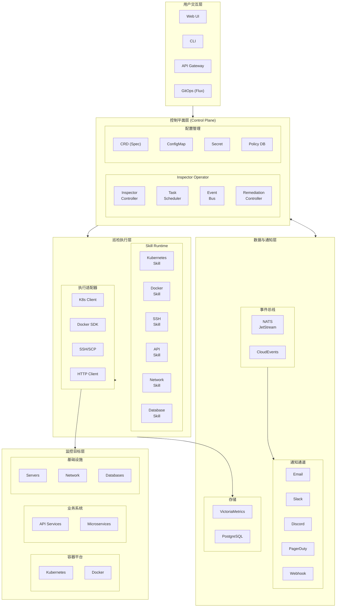

## 2. 控制循环流程

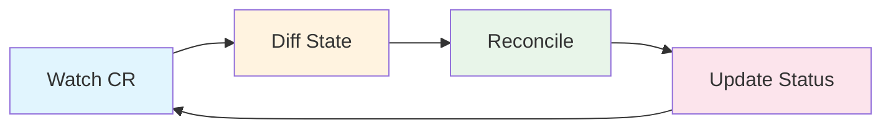

## 3. 事件驱动流程

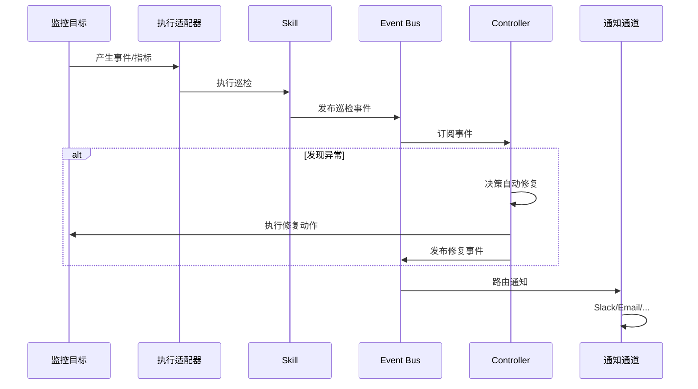

## 4. Skill执行流程

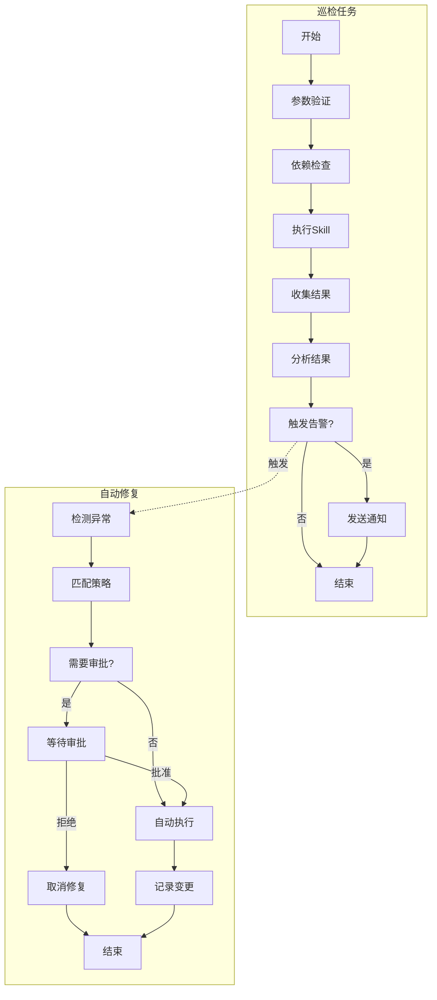

## 5. 部署架构

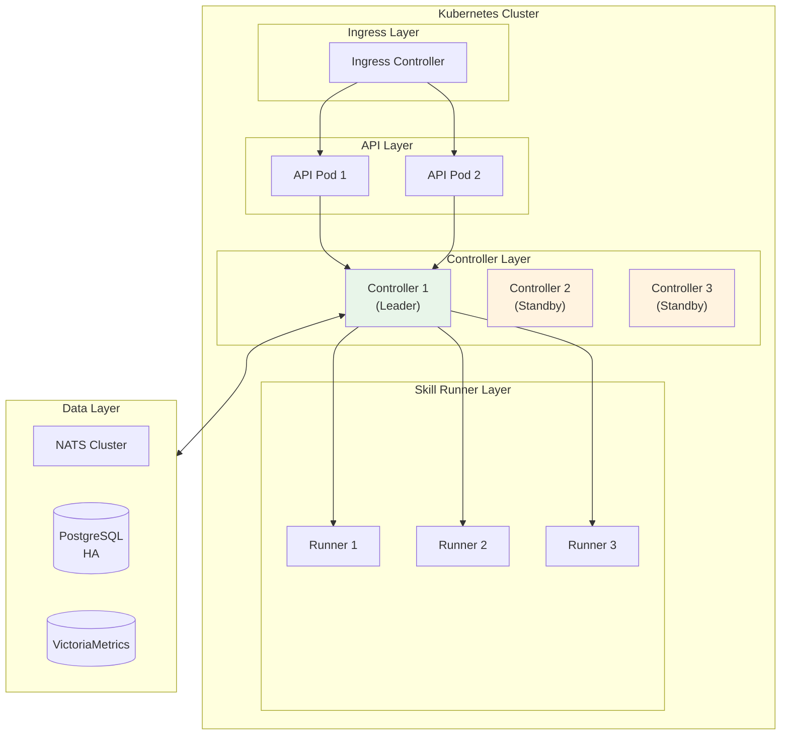

## 6. 数据流图

```mermaid
flowchart LR
    subgraph Sources["数据源"]
        Metrics["Metrics"]
        Logs["Logs"]
        Events["Events"]
        Traces["Traces"]
    end
    
    subgraph Collection["采集层"]
        OTel["OpenTelemetry"]
        Exporters["Exporters"]
    end
    
    subgraph Processing["处理层"]
        Skills["Skills"]
        Rules["Rule Engine"]
        ML["ML Analysis"]
    end
    
    subgraph Storage["存储层"]
        TSDB["Time Series DB"]
        RelDB["Relational DB"]
        ObjStore["Object Store"]
    end
    
    subgraph Consumption["消费层"]
        Dashboard["Dashboard"]
        Alerts["Alerts"]
        Reports["Reports"]
        API["API"]
    end
    
    Sources --> Collection
    Collection --> Processing
    Processing --> Storage
    Storage --> Consumption
```

## 7. 通知路由流程

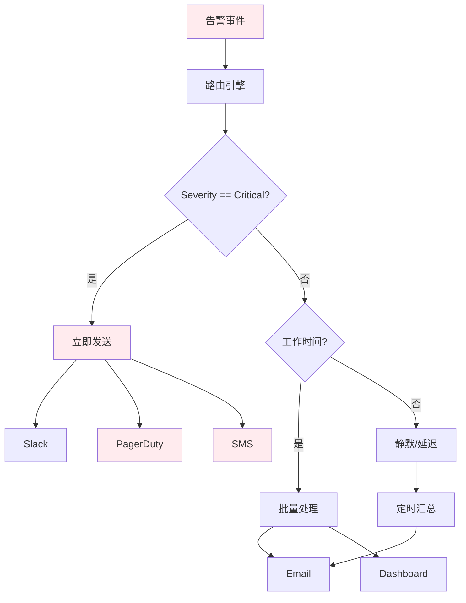

## 8. 多层级配置架构

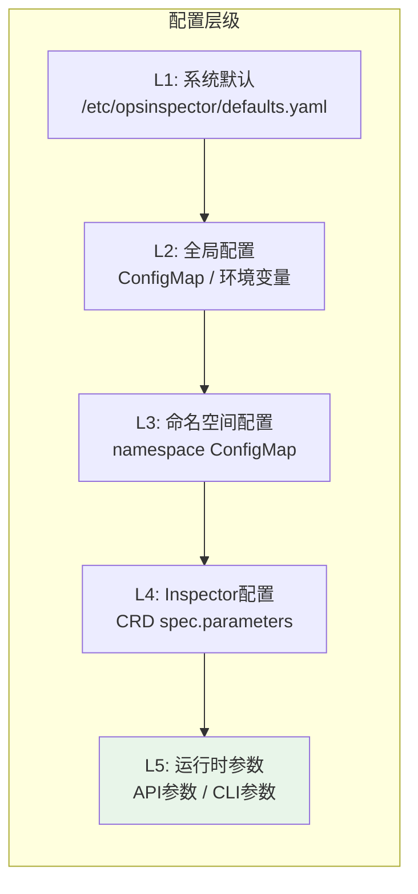

## 9. 自动修复决策流程

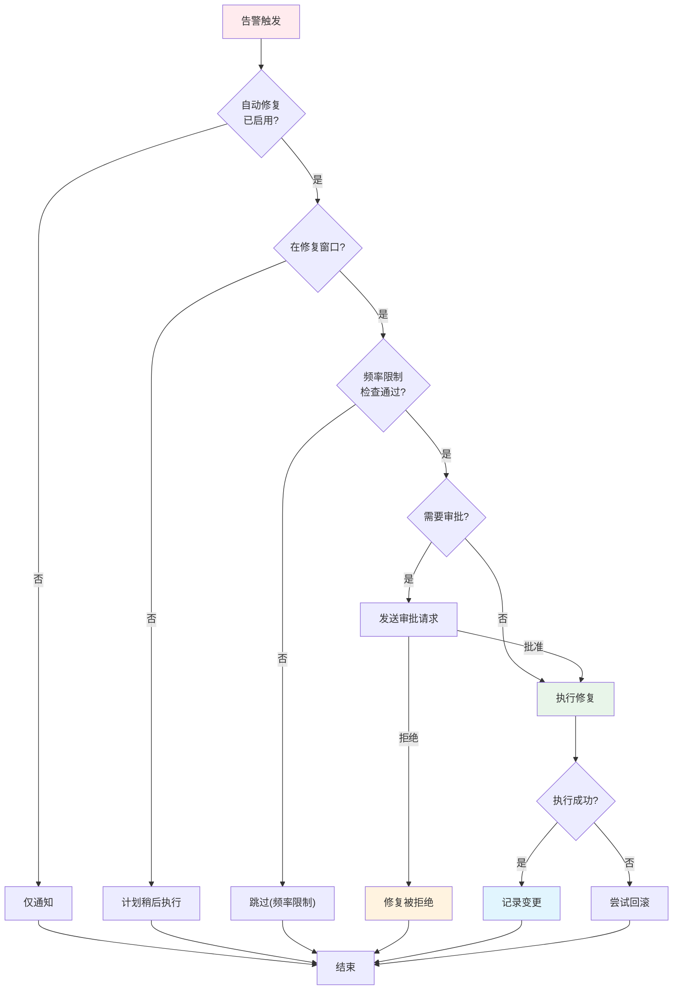

## 10. Skill生命周期

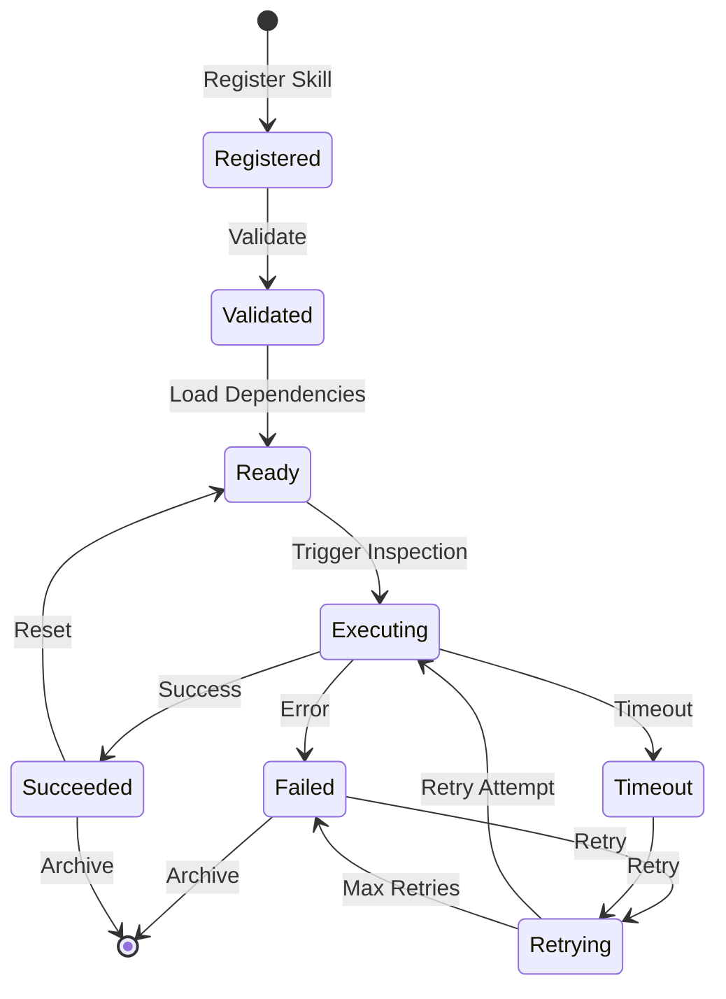

## 11. 技术栈映射

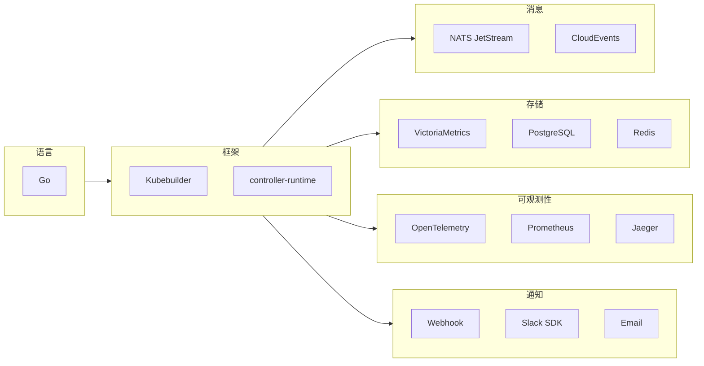
