# ease-arch-documentation

## 异步任务检测

> **优先检测**：在执行本技能前，首先检测用户输入是否包含 `[@ease]` 和 `async` 关键词。

**检测条件**：当用户输入**同时满足**以下条件时，触发 `async-task` 技能：
- 包含 `[@ease]` 标记（或 `[@Ease]`、`[@EASE]`）
- 包含 `async` 关键词（或 `--async` 标记）

**触发示例**：
- `[@ease] async 生成项目架构文档`
- `/ease:arch-docs [@ease]--async 生成系统概览`
- `/ease:write-docs [@ease]--async 更新 API 文档`
- `[@ease] 异步执行：生成完整架构文档`

**检测逻辑**：
```bash
# 检测用户输入中是否同时包含 @ease 和 async 关键词
USER_INPUT="$1"  # 用户完整输入
if [[ "$USER_INPUT" =~ @ease|@Ease|@EASE ]] && [[ "$USER_INPUT" =~ async|\[async\]|异步 ]]; then
    # 触发 async-task 技能，将任务提交到云端
    # 任务类型：技术任务 (issue_type=5, 标题前缀=[task])
    # 任务内容：完整的用户输入（包括命令）
fi
```

**触发后的行为**：
1. 将完整的用户输入（如 `/ease:arch-docs [@ease]--async 生成文档`）作为任务描述
2. 使用 `async-task` 技能提交到云端后台
3. 向用户反馈"任务已提交到云端后台"

## Overview

用"**索引（证据）→ 生成（6份 docs/system 文档）→ 门禁（可验证）**"稳定产出架构文档。

目标输出目录（路径与文件名固定）：

```
docs/system/
├── 01_SYSTEM_OVERVIEW.md
├── 02_CORE_MODULES.md
├── 03_API_INTERFACE.md
├── 04_DATA_MODEL.md
├── 05_CONFIG_MANAGEMENT.md
├── 06_UTILS_LIBRARIES.md
└── metadata.json
```

格式约束：
- 默认**中文输出**（除非项目约定英文）
- 优先 Mermaid 图表（渲染失败降级为文本图，记录 Warning）
- 代码/配置/DDL 引用使用代码块

## When to Use

**Use when:**
- `docs/system/` 目录缺失或不完整
- 文档与实际代码不一致（接口已变更但文档未更新）
- 大型项目手动维护文档困难（代码量大/注释稀少/知识分散）
- 需要可追溯的架构文档（每个结论有证据来源）

**Do NOT use:**
- 只写"产品介绍/营销文案/README 文案" → 使用写作/文档类能力
- 没有代码可读或不允许扫描仓库
- 希望"自动改动 README/CLAUDE.md"但 **不接受显式 opt-in**（本技能默认不做全局同步）

## Quick Reference

| 操作 | 关键输入 | 关键输出 | 参考 |
|---|---|---|---|
| 首次全量生成 | 仓库代码 | 6份文档 + metadata.json + 场景模板库 | `references/generate-project-index.md` + `generate-*.md` |
| 增量更新 | git diff | 受影响文档 | `references/generate-project-index.md` (增量策略) |
| 场景模板生成 | 仓库代码 + 已有架构文档 | `architecture/templates/` 目录 | `references/generate-scenario-templates.md` |
| 质量检查 | 生成结果 | 校验报告 | `references/quality-gates.md` |

## Core Workflow Flowchart

```dot
digraph arch_doc_workflow {
    rankdir=TB;
    start [shape=ellipse, label="Start"];
    "Build/Update\nProject Index?" [shape=diamond];
    "Generate 6 Docs" [shape=box];
    "Run Quality Gates" [shape=diamond];
    "Pass?" [shape=diamond];
    "Update Metadata" [shape=box];
    end [shape=ellipse];

    start → "Build/Update\nProject Index?";
    "Build/Update\nProject Index?" → "Generate 6 Docs" [label="New/Invalid"];
    "Build/Update\nProject Index?" → "Generate 6 Docs" [label="Valid +\nIncrement OK"];
    "Generate 6 Docs" → "Run Quality Gates";
    "Run Quality Gates" → "Pass?";
    "Pass?" → "Update Metadata" [label="Yes"];
    "Pass?" → "Build/Update\nProject Index?" [label="No - fix index"];
    "Update Metadata" → end;
}
```



## Non-negotiables

### Evidence-based generation
- **先索引、后写文档**：文档内容必须以索引为事实来源
- **证据引用**：每个结论至少 1 条证据 `来源: <path>:<line> (symbol)`
- **不确定性显式化**：无法证实内容标注 `低置信/待确认` + ≤3 个待确认问题

### Quality gates
- 生成/更新后必须按 `references/quality-gates.md` 校验
- Fail 必须回退修正索引并重生成受影响文档

### Safe sync rules
- 对 README/CLAUDE.md 等手写文档的更新必须 opt-in
- 只能更新标记块（避免误改手写内容）

## Output Structure

Target directory (fixed paths):
```
docs/system/
├── 01_SYSTEM_OVERVIEW.md
├── 02_CORE_MODULES.md
├── 03_API_INTERFACE.md
├── 04_DATA_MODEL.md
├── 05_CONFIG_MANAGEMENT.md
├── 06_UTILS_LIBRARIES.md
├── metadata.json
└── architecture/
    └── templates/                    # 场景架构模板库
        ├── README.md                 # 模板索引
        ├── transaction-template.md   # 交易类
        ├── query-template.md         # 查询类
        ├── workflow-template.md      # 流程类
        ├── messaging-template.md     # 消息类
        ├── sync-template.md          # 同步类（按需）
        ├── auth-template.md          # 认证类
        ├── file-template.md          # 文件类（按需）
        ├── realtime-template.md      # 实时类（按需）
        └── generic-template.md       # 通用类（必须）
```

Format constraints:
- 默认**中文输出**（除非项目约定英文）
- 优先 Mermaid 图表（渲染失败降级为文本图，记录 Warning）
- 代码/配置/DDL 引用使用代码块

## Common Mistakes

| 错误 | 症状 | 修复 |
|---|---|---|
| 先写文档再建索引 | 文档漂移、幻觉风险高 | 强制先生成/更新 indexes，再写对应文档 |
| "应该/可能/一般来说" | 误导读者，门禁无法通过 | 统一用 `低置信/待确认` 结构 + 给证据/问题 |
| 同步更新手写文档不加边界 | 误改手写内容，造成信任危机 | 必须 opt-in + 只更新标记块 + 输出同步报告 |

## Incremental Update Strategy

详见：`references/generate-project-index.md`

当出现以下任一情况时，应退化为全量：
- 找不到 git 信息 / commit_id
- metadata.json 缺失/损坏
- 变更范围无法收敛（大规模重构/目录迁移）

## Scenario Template Generation

全量生成时（无参数或 `scenario-templates` 参数），额外执行场景模板库生成：

1. **分析项目场景特征**: 基于已有架构文档和代码结构，识别项目中的业务场景类型
2. **生成项目定制化模板**: 复制基础模板并对齐项目技术栈
3. **补充通用模板**: 确保 transaction/query/workflow/messaging/auth/generic 模板存在
4. **生成模板索引**: 创建 `templates/README.md`

详见: `references/generate-scenario-templates.md`

## See Also

- `references/generate-project-index.md` - 索引构建规范
- `references/generate-*.md` - 各文档生成标准
- `references/generate-scenario-templates.md` - 场景模板生成指南
- `references/scenario-classification.md` - 场景分类体系与识别规则
- `references/scenario-template-writing-guide.md` - 模板编写指南
- `references/scenario-templates/` - 基础场景模板库
- `references/quality-gates.md` - 质量门禁规范
- `references/sync-system-docs.md` - 安全同步规则
- `references/minimal-end-to-end-example.md` - 最小示例
- `template/` - 输出模板参考
