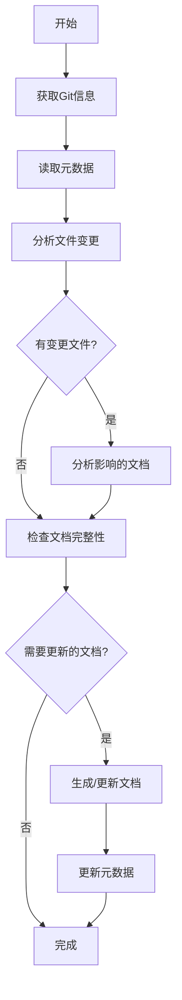

# 架构文档生成工作流程
本文档用于指导如何生成项目的API接口文档生成，这里需要梳理出项目中所有的HTTP和RMB接口，并按照核心模块分析出的核心业务功能模块进行归类

## 1. 整体流程概述

### 1.1 增量生成机制
为了提高文档生成效率，采用增量生成机制，基于Git commit差异只更新受影响的内容：



### 1.2 标准目录结构
```
文档输出到docs/system/03_API_INTERFACE.md        # API接口文档


注意：
文档都以中文输出，文档都以中文输出，文档都以中文输出
所有的图表用Mermaid绘画
所有的代码引用用``` 代码 ```包起来
```

## 2. 详细执行步骤

### 2.1 第一阶段：API接口文档生成
**目标文件**: `03_API_INTERFACE.md`

**执行步骤**:
1. **接口分类**
   - 严格区分HTTP接口和RMB接口两大类
   - HTTP接口基于Spring Web框架实现，提供RESTful API服务
   - RMB (Remote Message Bus) 接口用于与外部系统进行异步消息通信

2. **HTTP接口分析**（以实际代码为准，保证可追溯）
   - **严格搜索Controller类**：只分析项目中实际存在的XXXController.java类文件
   - **精确提取注解信息**：只分析@Controller/@RestController类中的@PostMapping、@GetMapping、@RequestMapping等注解
   - **准确提取URL路径**：基于@RequestMapping(value = "xxx")或者@PostMapping、@GetMapping、@PathVariable和类上的@RequestMapping组合完整路径
   - **准确归类接口所属的功能模块**：分析接口功能，并将接口归类到02_CORE_MODULES.md识别出的具体的某一个功能模块
   - **提取真实方法信息**：方法名作为接口功能描述，参数类型和注解作为请求参数
   - **接口清单以 Controller 实现为准**：接口条目来自实际存在的 Controller 类与 mapping 注解，并提供 `source` 证据定位

3. **RMB接口分析**（以实际代码为准，保证可追溯）
   - 搜索项目中使用 @MumbleMessageService 注解的接口类
   - 提取 serviceId 作为 RMB 接口的唯一标识，并解析到具体数值；当 serviceId 来自常量/枚举/变量时，继续追溯并输出最终数值，同时提供 `source` 证据定位（常量定义处与使用处）
   - 分析接口方法和参数定义
   - 识别接口所属功能模块

4. **接口详情整理**
   - **HTTP接口格式要求**：
     * URL路径：完整的请求路径（如/merchant/new、/approver/applyNew）
     * HTTP方法：POST/GET等实际使用的HTTP方法
     * 归属模块：分析接口功能，并将接口归类到02_CORE_MODULES.md识别出来的具体的某一个功能模块
     * 功能描述：基于方法注释和方法名确定
     * 请求参数：基于@RequestBody、@RequestParam、@PathVariable等注解的实际参数
     * 响应示例：基于返回类型的DTO结构生成标准格式
   - **RMB接口格式要求**：
     * serviceId：@MumbleMessageService注解中的serviceId值，如果存在引用请给出具体引用的值
     * 归属模块：基于接口类所在的业务模块
     * 功能描述：基于类注释和方法注释
     * 请求参数：@MumbleMessageService注解中的requestMessageClass的值,基于方法参数的实际定义给出完整类路径
     * 响应示例：基于返回类型的DTO结构生成标准格式
   - **质量控制**：
     * 所有接口必须能在实际Controller类中找到对应实现
     * 接口路径和方法必须与代码完全一致
     * 参数定义必须基于实际的DTO类结构
      * 以源码可定位证据为事实来源；对于证据不足的字段以“低置信/待确认”呈现


## 3. 质量控制检查点

### 3.1 格式规范检查
- [x] 标题层级正确(二级标题为主章节)
- [x] 代码块格式正确(使用三个反引号)
- [x] 表格对齐整齐(使用Markdown表格语法)
- [x] 图表语法正确(Mermaid语法无误)

### 3.2 内容完整性检查
- [x] 包含所有要求的小节
- [x] 关键信息无遗漏
- [x] 描述准确无歧义
- [x] 符合实际代码结构

### 3.3 一致性检查
- [x] 文档风格统一
- [x] 术语使用一致
- [x] 引用链接有效
- [x] 版本标识清晰
