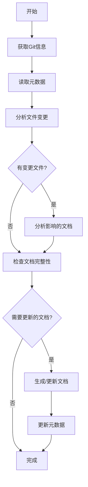

# 架构文档生成工作流程
本文档用于指导如何生成项目的架构文档，架构文档包含6份文档和一份元数据文件，架构文档的生成支持增量和全量模式

## 1. 整体流程概述

### 1.1 增量生成机制
为了提高文档生成效率，采用增量生成机制，基于Git commit差异只更新受影响的文档：



### 1.2 标准目录结构
```
所有文档必须输出到docs/system/
├── 01_SYSTEM_OVERVIEW.md      # 系统概览文档
├── 02_CORE_MODULES.md         # 核心模块文档
├── 03_API_INTERFACE.md        # API接口文档
├── 04_DATA_MODEL.md           # 数据模型文档
├── 05_CONFIG_MANAGEMENT.md    # 配置管理文档
├── 06_UTILS_LIBRARIES.md      # 工具库文档
└── metadata.json              # 元数据文件

注意：
所有的文档都以中文输出，所有的文档都以中文输出，所有的文档都以中文输出
所有的图表用Mermaid绘画
所有的代码引用用``` 代码 ```包起来

```

## 2. 详细执行步骤

### 2.1 第一阶段：系统概览文档生成
**目标文件**: `01_SYSTEM_OVERVIEW.md`

**执行脚本**: `generate-system-overview.md`


### 2.2 第二阶段：核心模块文档生成
**目标文件**: `02_CORE_MODULES.md`

**执行脚本**: `generate-core-modules.md`


### 2.3 第三阶段：API接口文档生成
**目标文件**: `generate-api-interface.md`

**执行脚本**: `generate-api-interface.md`

### 2.4 第四阶段：数据模型文档生成
**目标文件**: `04_DATA_MODEL.md`

**执行脚本**: `generate-data-model.md`

### 2.5 第五阶段：配置管理文档生成
**目标文件**: `05_CONFIG_MANAGEMENT.md`

**执行脚本**: `generate-config-management.md`


### 2.6 第六阶段：工具库文档生成
**目标文件**: `06_UTILS_LIBRARIES.md`

**执行脚本**: `generate-utils-libraries.md`


## 3. 质量控制检查点

### 3.1 格式规范检查
- [x] 标题层级正确(二级标题为主章节)
- [x] 代码块格式正确(使用三个反引号)
- [x] 表格对齐整齐(使用Markdown表格语法)
- [x] 图表语法正确(Mermaid语法无误)

### 3.2 内容完整性检查
- [x] 包含所有要求的小节
- [x] 关键信息无遗漏
- [x] 描述准确无歧义
- [x] 符合实际代码结构

### 3.3 一致性检查
- [x] 文档风格统一
- [x] 术语使用一致
- [x] 引用链接有效
- [x] 版本标识清晰


## 4. 异常处理机制

### 4.1 常见问题
- **代码结构与预期不符**: 暂停生成，重新分析项目结构
- **缺少必要的目录或文件**: 记录缺失项，继续生成其他文档
- **无法理解的复杂逻辑**: 标记为待确认，后续补充完善

### 4.2 处理策略
1. **暂停机制**: 遇到严重问题立即停止当前文档生成
2. **跳过机制**: 对于非关键缺失可以跳过继续处理
3. **标记机制**: 对不确定的内容进行标记，便于后续完善

## 5. 检查

### 5.1 增量更新机制

#### 5.1.1 Git差异分析
- 自动记录上次生成时的commit ID
- 比较当前commit与上次commit的差异
- 只分析变更的文件来确定影响的文档

#### 5.1.2 智能更新策略
- **首次运行**: 生成所有6份文档
- **后续运行**: 只更新受影响的文档
- **缺失处理**: 自动检测并重新生成缺失的文档
- **完整性检查**: 验证文档格式和内容完整性

### 5.2 元数据管理

#### 5.2.1 metadata.json文件
存储生成过程的关键信息：
```json
{
  "last_generation": {
    "timestamp": "2025-10-30T11:20:18",
    "branch": "feature/noworkflow",
    "commit_id": "5c53f435e423f16001c19d852bc29f9f5a807051",
    "generated_documents": [
      "01_SYSTEM_OVERVIEW.md",
      "02_CORE_MODULES.md",
      "03_API_INTERFACE.md",
      "04_DATA_MODEL.md",
      "05_CONFIG_MANAGEMENT.md",
      "06_UTILS_LIBRARIES.md"
    ]
  }
}
```

## 6. 最佳实践总结

### 6.1 执行建议
1. **按顺序生成**: 严格按照既定顺序执行，确保依赖关系正确
2. **及时验证**: 每个文档生成后及时检查内容准确性
3. **交叉验证**: 通过多个角度验证同一信息的准确性

### 6.2 质量保证
1. **多人审查**: 重要文档建议多人参与审查
2. **工具辅助**: 使用自动化工具检查格式和链接有效性
3. **持续改进**: 根据使用反馈不断优化文档结构和内容

### 6.3 效率提升
1. **集成CI/CD**: 将脚本集成到持续集成流程中
2. **定期执行**: 建议在代码重大变更后执行
3. **版本控制**: 将生成的文档纳入Git版本控制
