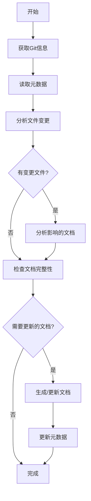

# 架构文档生成工作流程
本文档用于指导如何生成项目的配置管理文档生成，这里需要分析项目resources目录下各个环境的配置文件，分析不同环境的核心配置

## 1. 整体流程概述

### 1.1 增量生成机制
为了提高文档生成效率，采用增量生成机制，基于Git commit差异只更新受影响的内容：



### 1.2 标准目录结构
```
文档输出到docs/system/05_CONFIG_MANAGEMENT.md    # 配置管理文档


注意：
文档都以中文输出，文档都以中文输出，文档都以中文输出
所有的图表用Mermaid绘画
所有的代码引用用``` 代码 ```包起来
```

## 2. 详细执行步骤

### 2.1 第一阶段：配置管理文档生成
**目标文件**: `05_CONFIG_MANAGEMENT.md`

**执行步骤**:
1. **环境配置分析**
   - 分析resources目录下不同环境(sit/prd)的配置差异
   - 识别核心环境变量和配置项
   - 说明配置文件的组织结构

2. **配置文件说明**
   - 详细解释主配置文件(xxxx.properties)
   - 分析环境特定配置(env目录下的所有环境，比如env/sit/和env/prd/)
   - 说明服务器环境配置(server.env)

3. **配置加载机制**
   - 说明配置优先级顺序
   - 分析配置注入方式(@Value, @ConfigurationProperties)
   - 描述配置类的设计模式

4. **安全管理**
   - 说明密码加密机制(RSA)
   - 识别敏感配置项
   - 描述配置访问控制策略


## 3. 质量控制检查点

### 3.1 格式规范检查
- [x] 标题层级正确(二级标题为主章节)
- [x] 代码块格式正确(使用三个反引号)
- [x] 表格对齐整齐(使用Markdown表格语法)
- [x] 图表语法正确(Mermaid语法无误)

### 3.2 内容完整性检查
- [x] 包含所有要求的小节
- [x] 关键信息无遗漏
- [x] 描述准确无歧义
- [x] 符合实际代码结构

### 3.3 一致性检查
- [x] 文档风格统一
- [x] 术语使用一致
- [x] 引用链接有效
- [x] 版本标识清晰
