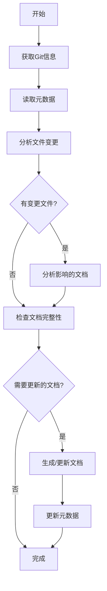

# 架构文档生成工作流程
本文档用于指导如何生成项目的核心模块文档生成，这里需要分析项目的核心业务模块，按照业务功能将系统划分为几个核心的模块，并识别每个核心模块的功能分别是什么，模块间是否存在关联，关联关系是什么，每个核心模块给个核心应用场景并给出交互图

## 1. 整体流程概述

### 1.1 增量生成机制
为了提高文档生成效率，采用增量生成机制，基于Git commit差异只更新受影响的内容：



### 1.2 标准目录结构
```
文档输出到docs/system/02_CORE_MODULES.md         # 核心模块文档


注意：
文档都以中文输出，文档都以中文输出，文档都以中文输出
所有的图表用Mermaid绘画
所有的代码引用用``` 代码 ```包起来
```

## 2. 详细执行步骤

### 2.1 第一阶段：系统概览文档生成
**目标文件**: `02_CORE_MODULES.md`

**执行步骤**:
1. **功能模块识别**
   - 基于业务功能划分模块（如商户管理、CCIF客户信息、文件存储、审批流程等）
   - 确定各功能模块的核心职责和业务边界
   - 识别模块间的业务依赖关系和数据流转

2. **模块职责说明**
   - 详细描述每个功能模块的业务职责
   - 说明模块在系统中的定位和价值
   - 分析模块与其他功能模块的交互关系

3. **业务流程分析**
   - 分析各功能模块的核心业务流程
   - 识别关键业务节点和决策点
   - 绘制业务流程图

4. **数据模型映射**
   - 将功能模块与数据模型进行映射
   - 说明模块涉及的主要数据实体
   - 分析数据的生命周期和状态转换

5. **接口契约定义**
   - 定义模块对外提供的服务接口
   - 说明模块依赖的外部服务
   - 描述模块间的数据交换格式


## 3. 质量控制检查点

### 3.1 格式规范检查
- [x] 标题层级正确(二级标题为主章节)
- [x] 代码块格式正确(使用三个反引号)
- [x] 表格对齐整齐(使用Markdown表格语法)
- [x] 图表语法正确(Mermaid语法无误)

### 3.2 内容完整性检查
- [x] 包含所有要求的小节
- [x] 关键信息无遗漏
- [x] 描述准确无歧义
- [x] 符合实际代码结构

### 3.3 一致性检查
- [x] 文档风格统一
- [x] 术语使用一致
- [x] 引用链接有效
- [x] 版本标识清晰
