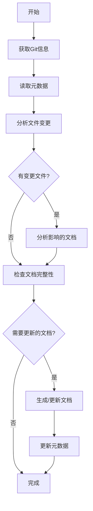

# 架构文档生成工作流程
本文档用于指导如何生成项目的数据模型文档生成，这里需要分析项目的DB脚本和MAPPER文件，识别项目设计的核心DB结构和直接的关联关系

## 1. 整体流程概述

### 1.1 增量生成机制
为了提高文档生成效率，采用增量生成机制，基于Git commit差异只更新受影响的内容：



### 1.2 标准目录结构
```
文档输出到docs/system/04_DATA_MODEL.md           # 数据模型文档


注意：
文档都以中文输出，文档都以中文输出，文档都以中文输出
所有的图表用Mermaid绘画
所有的代码引用用``` 代码 ```包起来
```

## 2. 详细执行步骤

### 2.1 第一阶段：数据模型文档生成
**目标文件**: `04_DATA_MODEL.md`

**执行步骤**:
1. **ER图设计**（严格基于实际SQL和实体类）
   - **扫描所有SQL文件**: 分析`src/main/resources/db/ddl/`和`dbScript/`目录下的所有SQL文件
   - **分析实体类**: 扫描`src/main/java/xxx/xxx/biz/entity/`目录下的所有实体类
   - **检查Mapper配置**: 分析`src/main/resources/mapper/`目录下的XML映射文件
   - **识别表关系**: 基于实际的外键约束和业务逻辑识别表间关系(一对一、一对多等)
   - **使用Mermaid ER图语法**: 绘制准确的实体关系图；图中表与字段仅来自实际 DDL/SQL/实体类/Mapper 证据

2. **表结构说明**（基于实际DDL语句）
   - **扫描所有建表语句**: 从SQL文件中提取CREATE TABLE语句
   - **详细描述每个表的主要字段**: 基于实际的字段定义和COMMENT注释
   - **说明字段的业务含义**: 严格使用SQL中的COMMENT内容作为字段说明
   - **识别主键、外键和索引**: 基于实际的PRIMARY KEY、FOREIGN KEY和INDEX定义
   - **数据类型准确映射**: 使用 SQL 中定义的实际数据类型，并在表结构说明中给出字段来源证据

3. **数据关系分析**（基于实际业务逻辑）
   - **表关系**: 识别表直接的关联关系，作用等

4. **约束和安全**（基于实际实现）
   - **数据完整性约束**: 基于实际的NOT NULL、DEFAULT、UNIQUE等约束定义
   - **索引策略**: 分析实际创建的索引及其业务目的
   - **数据安全措施**: 基于实际的加密字段和脱敏策略
   - **备份策略**: 说明基于实际的版本控制字段(update_time, version)


## 3. 质量控制检查点

### 3.1 格式规范检查
- [x] 标题层级正确(二级标题为主章节)
- [x] 代码块格式正确(使用三个反引号)
- [x] 表格对齐整齐(使用Markdown表格语法)
- [x] 图表语法正确(Mermaid语法无误)

### 3.2 内容完整性检查
- [x] 包含所有要求的小节
- [x] 关键信息无遗漏
- [x] 描述准确无歧义
- [x] 符合实际代码结构

### 3.3 一致性检查
- [x] 文档风格统一
- [x] 术语使用一致
- [x] 引用链接有效
- [x] 版本标识清晰
