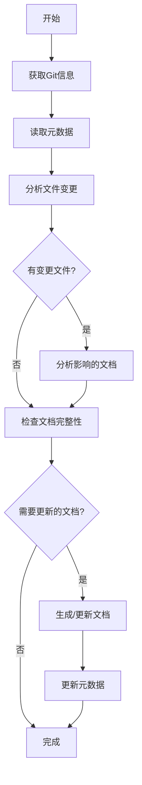

# 架构文档生成工作流程
本文档用于指导如何生成项目的系统概览文档生成，系统概览文档包含项目使用的前后端技术栈及其版本，中间件列表，架构图，系统的高可用性，可扩展性，安全性，部署环境，项目的目录结构说明

## 1. 整体流程概述

### 1.1 增量生成机制
为了提高文档生成效率，采用增量生成机制，基于Git commit差异只更新受影响的内容：



### 1.2 标准目录结构
```
所有文档输出到docs/system/01_SYSTEM_OVERVIEW.md      # 系统概览文档


注意：
文档都以中文输出，文档都以中文输出，文档都以中文输出
所有的图表用Mermaid绘画
所有的代码引用用``` 代码 ```包起来
```

## 2. 详细执行步骤

### 2.1 第一阶段：系统概览文档生成
**目标文件**: `01_SYSTEM_OVERVIEW.md`

**执行步骤**:
1. **技术栈分析**
   - 分析`build.gradle`，`gradle.properties`文件确定框架版本
   - 检查`pom.xml`或依赖配置确定第三方库
   - 识别核心组件(Spring Boot, MyBatis, Redis, MumbleSDK等)
   - 识别中间件列表（服务注册：GNS (Global Name Service) 服务发现；消息通信：RMB (Remote Message Bus) 内部服务通信；文件存储：FPS (File Process Service) 文件存储服务；配置管理：WeConf (Webank内部配置中心)；用户权限管理：UM；客户信息管理：ECIF（Webank内部用户信息管理））

2. **架构图绘制**
   - 识别系统层次结构(前端→网关→服务→存储)
   - 确定外部依赖(数据库、缓存、文件存储、消息总线)
   - 使用Mermaid语法绘制系统架构图

3. **部署环境分析**
   - 检查`server.env`,resources目录下各个环境的配置文件
   - 分析环境变量和JVM配置
   - 确定数据库和缓存配置

4. **项目结构梳理**
   - 分析`src/main/java`目录结构
   - 识别各包的职责和功能


## 3. 质量控制检查点

### 3.1 格式规范检查
- [x] 标题层级正确(二级标题为主章节)
- [x] 代码块格式正确(使用三个反引号)
- [x] 表格对齐整齐(使用Markdown表格语法)
- [x] 图表语法正确(Mermaid语法无误)

### 3.2 内容完整性检查
- [x] 包含所有要求的小节
- [x] 关键信息无遗漏
- [x] 描述准确无歧义
- [x] 符合实际代码结构

### 3.3 一致性检查
- [x] 文档风格统一
- [x] 术语使用一致
- [x] 引用链接有效
- [x] 版本标识清晰
