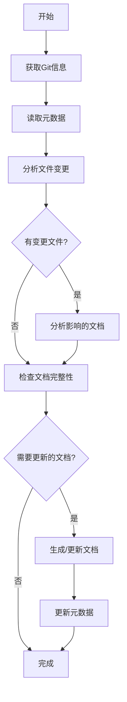

# 架构文档生成工作流程
本文档用于指导如何生成项目的工具库文档生成，这里需要分析项目的工具类以及经典或可能被其他项目复用的代码块，提取出来，总结功能，方便其他项目复用

## 1. 整体流程概述

### 1.1 增量生成机制
为了提高文档生成效率，采用增量生成机制，基于Git commit差异只更新受影响的内容：



### 1.2 标准目录结构
```
文档输出到docs/system/06_UTILS_LIBRARIES.md      # 工具库文档


注意：
文档都以中文输出，文档都以中文输出，文档都以中文输出
所有的图表用Mermaid绘画
所有的代码引用用``` 代码 ```包起来
```

## 2. 详细执行步骤

### 2.1 第一阶段：工具库文档生成
**目标文件**: `06_UTILS_LIBRARIES.md`

**执行步骤**:
1. **公共方法库分析**
   - 识别utils包中的工具类
   - 分析工具类的功能和使用场景
   - 说明主要方法的参数和返回值

2. **第三方依赖梳理**
   - 分析build.gradle中的依赖配置
   - 分类整理核心框架依赖
   - 说明工具类和数据库相关依赖

3. **自定义注解**
   - 识别自定义注解类
   - 说明注解的用途和使用方式
   - 提供使用示例

4. **常量定义**
   - 分析constant包中的常量类
   - 说明业务常量的含义和用途
   - 识别系统级常量配置

5. **异常处理**
   - 识别自定义异常类
   - 分析异常处理工具方法
   - 提供工具类使用示例
   
6. **代码复用**
   - 识别项目中高质量的代码或框架，提取并分析其功能
   - 分析项目中可能被其他项目复用的代码块，提取并分析其功能 


## 3. 质量控制检查点

### 3.1 格式规范检查
- [x] 标题层级正确(二级标题为主章节)
- [x] 代码块格式正确(使用三个反引号)
- [x] 表格对齐整齐(使用Markdown表格语法)
- [x] 图表语法正确(Mermaid语法无误)

### 3.2 内容完整性检查
- [x] 包含所有要求的小节
- [x] 关键信息无遗漏
- [x] 描述准确无歧义
- [x] 符合实际代码结构

### 3.3 一致性检查
- [x] 文档风格统一
- [x] 术语使用一致
- [x] 引用链接有效
- [x] 版本标识清晰
