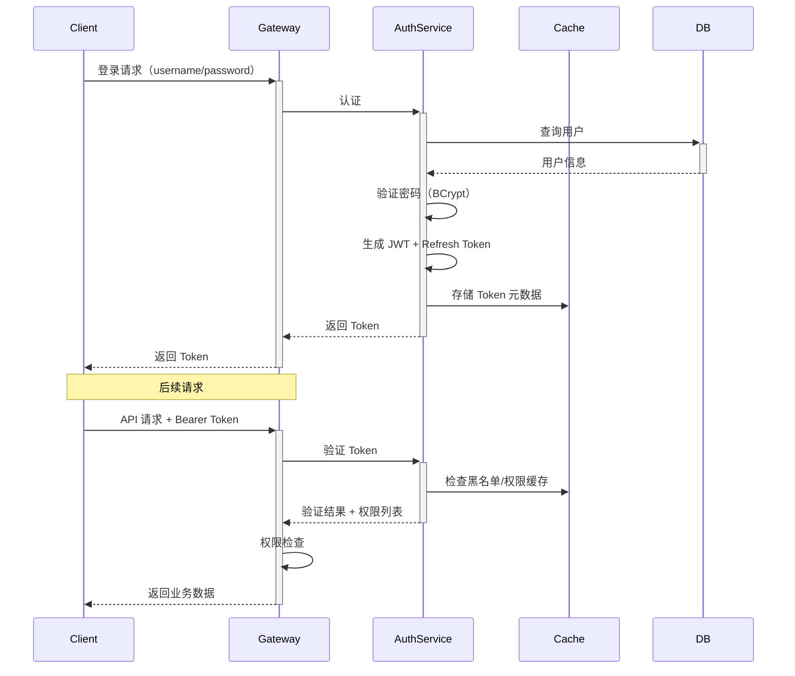

# 认证类架构模板 (Auth Architecture Template)

## 模板元数据

- **场景类型**: auth
- **适用用例**: 用户登录、注册、SSO、OAuth2、权限校验、角色管理
- **版本**: v1.0

## 1. 架构模式推荐

- **核心模式**: RBAC（Role-Based Access Control）
- **备选模式**: ABAC（Attribute-Based Access Control，细粒度场景）
- **认证协议**: JWT + Refresh Token（无状态）/ Session（有状态）
- **SSO 场景**: OAuth2 / OIDC / SAML

## 2. 技术栈推荐

### 2.1 数据库

- **用户库**: MySQL / PostgreSQL
- **权限数据**: 用户-角色-权限关系表

### 2.2 缓存策略

- **缓存类型**: Redis（Token 黑名单、权限缓存、验证码、限流计数）
- **Session 存储**: Redis（分布式 Session 场景）
- **缓存失效**: 权限变更时主动清除

### 2.3 安全组件

- **密码哈希**: BCrypt / Argon2
- **Token 签发**: JWT（RS256 / HS256）
- **MFA**: TOTP（Google Authenticator）/ SMS

## 3. 组件清单

### 3.1 核心组件

| 组件名 | 职责 | 必需性 |
|--------|------|--------|
| AuthenticationService | 认证服务（登录/注册） | 必需 |
| AuthorizationService | 授权服务（权限校验） | 必需 |
| TokenProvider | Token 签发/验证/刷新 | 必需 |
| PasswordEncoder | 密码加密 | 必需 |
| UserRepository | 用户数据访问 | 必需 |

### 3.2 扩展组件

| 组件名 | 职责 | 必需性 |
|--------|------|--------|
| RoleService | 角色管理服务 | 推荐 |
| PermissionCache | 权限缓存管理 | 推荐 |
| LoginAttemptTracker | 登录尝试追踪（防暴力破解） | 推荐 |
| AuditLogger | 安全审计日志 | 必需 |

## 4. 数据流设计



## 5. 接口契约模板

### 5.1 登录

```
POST /api/v1/auth/login
请求体: { "username": "...", "password": "...", "mfa_code": "..." }
响应体: { "access_token": "...", "refresh_token": "...", "expires_in": 3600 }
```

### 5.2 刷新 Token

```
POST /api/v1/auth/refresh
请求体: { "refresh_token": "..." }
```

### 5.3 权限校验

```
GET /api/v1/auth/permissions?resource=order&action=create
```

## 6. 安全考虑

- **密码策略**: 最小长度 8 位、复杂度要求、历史密码检查
- **暴力破解防护**: 连续失败锁定（5 次/15 分钟）
- **Token 安全**: HttpOnly Cookie、短过期时间、Refresh Token 轮转
- **CSRF 防护**: SameSite Cookie / CSRF Token
- **审计日志**: 所有认证事件记录（登录/登出/密码修改/权限变更）

## 7. 性能优化

| 指标 | 目标 | 优化策略 |
|------|------|---------|
| 登录延迟 | < 500ms | 缓存用户权限、异步审计日志 |
| Token 验证 | < 10ms | JWT 本地验证（无需查库） |
| 权限检查 | < 50ms | Redis 缓存权限树 |

## 8. 可观测性

### 关键指标

- 登录成功率/失败率
- Token 签发/刷新频率
- 权限拒绝次数
- 锁定账户数

### 告警阈值

- 登录失败率 > 20%（可能暴力攻击）
- 异常 IP 登录

## 9. 测试策略

| 测试类型 | 重点场景 |
|----------|---------|
| 单元测试 | 密码验证、Token 生成/解析、权限匹配 |
| 集成测试 | 完整登录流程、Token 刷新、权限拦截 |
| 安全测试 | 暴力破解、Token 篡改、越权访问、SQL 注入 |

## 10. 定制化参数

| 参数名 | 说明 | 默认值 |
|--------|------|--------|
| `ACCESS_TOKEN_EXPIRE` | 访问 Token 过期时间 | 1h |
| `REFRESH_TOKEN_EXPIRE` | 刷新 Token 过期时间 | 7d |
| `MAX_LOGIN_ATTEMPTS` | 最大登录失败次数 | 5 |
| `LOCKOUT_DURATION` | 账户锁定时长 | 15min |
| `PASSWORD_MIN_LENGTH` | 密码最小长度 | 8 |
