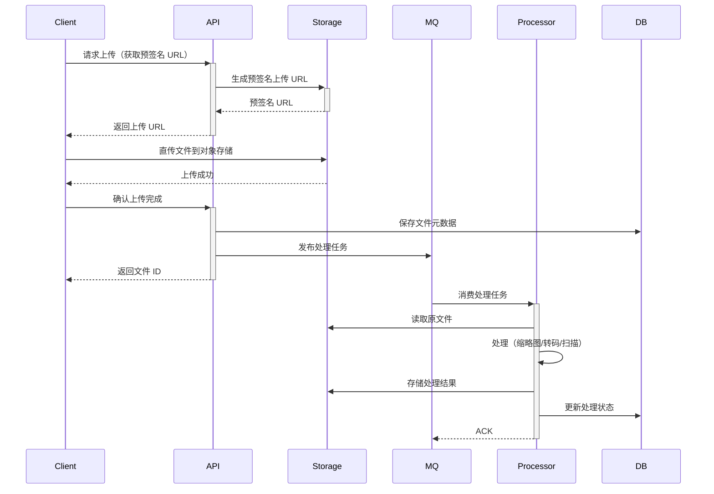

# 文件处理类架构模板 (File Architecture Template)

## 模板元数据

- **场景类型**: file
- **适用用例**: 文件上传、下载、图片处理、视频转码、文档预览
- **版本**: v1.0

## 1. 架构模式推荐

- **核心模式**: 对象存储 + 异步处理管道
- **备选模式**: 分块上传 + 断点续传（大文件场景）
- **简化模式**: 本地文件系统（开发/测试环境）
- **不推荐**: 数据库存储文件（BLOB）

## 2. 技术栈推荐

### 2.1 存储

- **对象存储**: MinIO / 阿里云 OSS / AWS S3
- **元数据库**: MySQL / PostgreSQL（文件记录）
- **CDN**: 静态文件加速分发

### 2.2 缓存策略

- **缓存类型**: Redis（预签名 URL 缓存、处理状态缓存）
- **CDN 缓存**: 静态文件长缓存

### 2.3 消息队列

- **用途**: 异步处理任务（缩略图生成、格式转换、病毒扫描）
- **推荐**: RabbitMQ / Kafka

## 3. 组件清单

### 3.1 核心组件

| 组件名 | 职责 | 必需性 |
|--------|------|--------|
| FileUploadService | 文件上传服务（分块/直传） | 必需 |
| FileDownloadService | 文件下载服务（预签名 URL） | 必需 |
| StorageAdapter | 存储适配器（对接不同存储后端） | 必需 |
| FileMetadataRepository | 文件元数据存储 | 必需 |

### 3.2 处理组件

| 组件名 | 职责 | 必需性 |
|--------|------|--------|
| ImageProcessor | 图片处理（缩略图、水印、裁剪） | 按需 |
| VideoTranscoder | 视频转码 | 按需 |
| FileScanner | 文件安全扫描（病毒检测） | 推荐 |

## 4. 数据流设计



## 5. 接口契约模板

### 5.1 获取上传 URL

```
POST /api/v1/files/upload-url
请求体: { "filename": "...", "content_type": "image/jpeg", "size": 1024000 }
响应体: { "upload_url": "...", "file_id": "...", "expires_in": 600 }
```

### 5.2 获取下载 URL

```
GET /api/v1/files/{id}/download-url
响应体: { "download_url": "...", "expires_in": 3600 }
```

## 6. 安全考虑

- **文件类型白名单**: 只允许指定类型上传
- **文件大小限制**: 配置最大上传大小
- **病毒扫描**: 上传后异步扫描
- **访问控制**: 预签名 URL + 过期时间
- **存储隔离**: 不同租户/业务的文件隔离存储

## 7. 性能优化

| 指标 | 目标 | 优化策略 |
|------|------|---------|
| 上传速度 | 取决于网络 | 直传对象存储、分块上传 |
| 下载速度 | < 100ms（首字节） | CDN 加速 |
| 处理延迟 | < 30s（图片）/ < 5min（视频） | 异步处理、并行管道 |

## 8. 可观测性

### 关键指标

- 上传/下载量
- 存储使用量
- 处理队列积压
- 处理失败率

### 告警阈值

- 处理队列积压 > 1000
- 存储使用率 > 80%

## 9. 测试策略

| 测试类型 | 重点场景 |
|----------|---------|
| 单元测试 | 文件类型校验、元数据解析 |
| 集成测试 | 上传-处理-下载完整流程、断点续传 |
| 压力测试 | 并发上传、大文件处理 |
| 安全测试 | 恶意文件上传、路径遍历 |

## 10. 定制化参数

| 参数名 | 说明 | 默认值 |
|--------|------|--------|
| `MAX_FILE_SIZE` | 最大文件大小 | 100MB |
| `ALLOWED_TYPES` | 允许的文件类型 | image/*,application/pdf |
| `UPLOAD_URL_EXPIRE` | 上传 URL 过期时间 | 600s |
| `DOWNLOAD_URL_EXPIRE` | 下载 URL 过期时间 | 3600s |
| `THUMBNAIL_SIZES` | 缩略图尺寸 | 100x100,300x300 |
