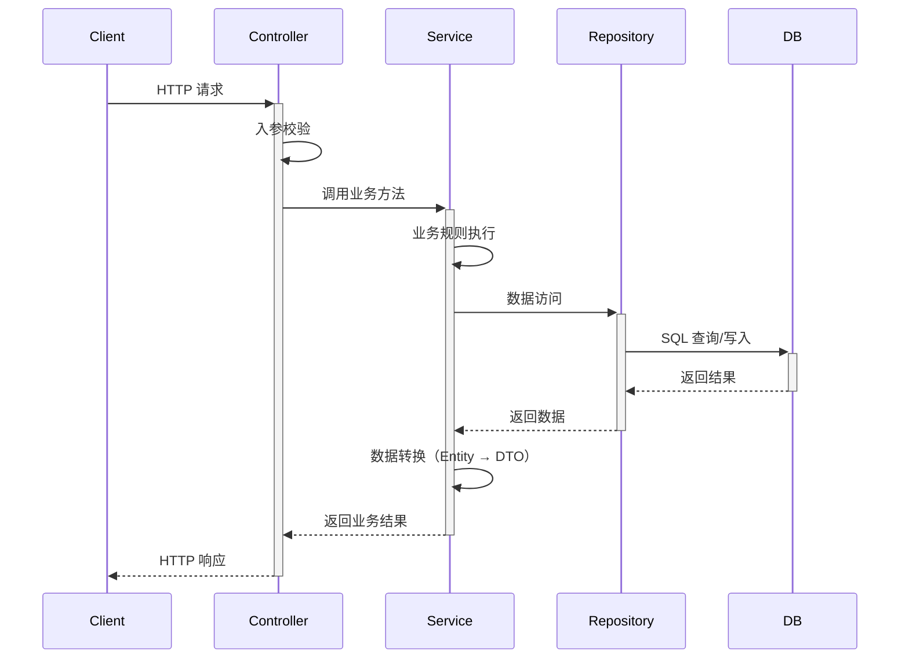

# 通用架构模板 (Generic Architecture Template)

## 模板元数据

- **场景类型**: generic
- **适用用例**: 无法匹配到特定场景的用例（兜底方案）
- **版本**: v1.0

## 1. 架构模式推荐

- **核心模式**: 标准分层架构（Controller → Service → Repository）
- **备选模式**: 六边形架构 / Clean Architecture（复杂业务）
- **原则**: 根据用例复杂度选择最简架构

## 2. 技术栈推荐

### 2.1 数据库

- **主库**: 根据项目现有技术栈选择（MySQL / PostgreSQL / MongoDB）
- **原则**: 与系统现有 `docs/system/architecture/01_SYSTEM_OVERVIEW.md` 对齐

### 2.2 缓存策略

- **按需引入**: 仅在性能要求明确时引入缓存
- **缓存类型**: Redis（分布式）/ 本地缓存（单机）

### 2.3 消息队列

- **按需引入**: 仅在有异步处理需求时引入
- **原则**: 与系统现有中间件对齐

## 3. 组件清单

### 3.1 核心组件（标准三层）

| 组件名 | 职责 | 必需性 |
|--------|------|--------|
| Controller / API | 接口层（入参校验、响应封装） | 必需 |
| Service | 业务层（业务编排、规则执行） | 必需 |
| Repository / DAO | 数据层（数据访问） | 必需 |
| Entity / Model | 领域模型 | 必需 |
| DTO / VO | 数据传输对象 | 推荐 |

### 3.2 通用扩展组件

| 组件名 | 职责 | 必需性 |
|--------|------|--------|
| Validator | 入参校验器 | 推荐 |
| Converter | 对象转换器（Entity ↔ DTO） | 推荐 |
| ExceptionHandler | 统一异常处理 | 推荐 |

## 4. 数据流设计



## 5. 接口契约模板

### 5.1 标准 CRUD

```
POST   /api/v1/{resources}          # 创建
GET    /api/v1/{resources}           # 列表查询
GET    /api/v1/{resources}/{id}      # 详情查询
PUT    /api/v1/{resources}/{id}      # 更新
DELETE /api/v1/{resources}/{id}      # 删除
```

### 5.2 统一响应格式

```json
{
  "code": 200,
  "message": "success",
  "data": { ... },
  "timestamp": "2024-01-15T10:00:00Z"
}
```

## 6. 安全考虑

- **入参校验**: 所有输入必须校验（类型、长度、范围）
- **认证授权**: 接入系统统一认证框架
- **SQL 注入**: 参数化查询
- **XSS 防护**: 输出编码

## 7. 性能优化

| 指标 | 目标 | 优化策略 |
|------|------|---------|
| API 延迟 | < 500ms（P99） | 合理 SQL 查询、索引优化 |
| 并发 | 根据业务需求 | 连接池、线程池合理配置 |

## 8. 可观测性

### 关键指标

- API 请求量 / 错误率
- 响应延迟（P50/P95/P99）
- 数据库查询耗时

### 告警阈值

- 错误率 > 1%
- P99 > 2s

## 9. 测试策略

| 测试类型 | 重点场景 |
|----------|---------|
| 单元测试 | 业务逻辑、数据转换、校验规则 |
| 集成测试 | CRUD 完整流程、异常处理 |

## 10. 定制化参数

| 参数名 | 说明 | 默认值 |
|--------|------|--------|
| `DEFAULT_PAGE_SIZE` | 默认分页大小 | 20 |
| `MAX_PAGE_SIZE` | 最大分页大小 | 100 |
| `API_TIMEOUT` | API 超时时间 | 30s |

## 使用说明

此模板为兜底方案，当场景识别引擎无法将用例匹配到特定场景模板时使用。建议在使用此模板时：

1. 确认是否确实无法匹配到更具体的场景模板
2. 根据用例的具体特征，从其他场景模板中借鉴相关章节
3. 在架构设计文档中说明使用通用模板的原因
