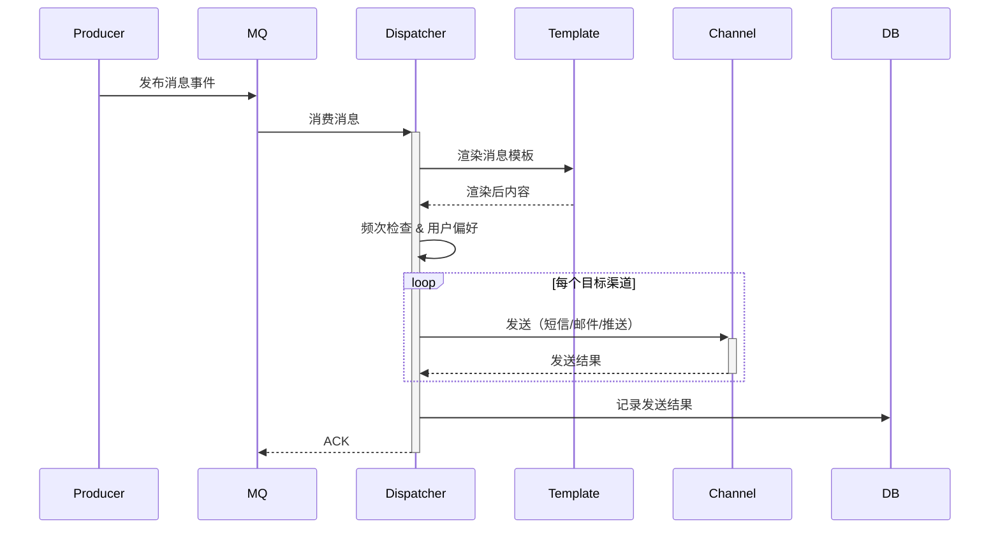

# 消息类架构模板 (Messaging Architecture Template)

## 模板元数据

- **场景类型**: messaging
- **适用用例**: 站内消息、短信通知、邮件推送、APP 推送、系统公告
- **版本**: v1.0

## 1. 架构模式推荐

- **核心模式**: 发布-订阅模式（Pub/Sub）+ 消息队列
- **备选模式**: 事件驱动架构（EDA）
- **简化模式**: 同步通知（低频场景）
- **不推荐**: 同步阻塞发送（高频通知场景）

## 2. 技术栈推荐

### 2.1 数据库

- **消息存储**: MySQL / PostgreSQL（消息记录、已读状态）
- **模板存储**: 数据库或配置文件

### 2.2 缓存策略

- **缓存类型**: Redis（未读计数、模板缓存）
- **缓存模式**: Write-Behind（异步更新已读状态）

### 2.3 消息队列

- **核心**: RabbitMQ / RocketMQ / Kafka
- **用途**: 异步消息分发、渠道路由、重试队列
- **可靠性**: 持久化 + ACK + 死信队列

### 2.4 外部通道

- 短信网关（阿里云 / 腾讯云 SMS）
- 邮件服务（SMTP / SES）
- APP 推送（JPush / FCM / APNs）

## 3. 组件清单

### 3.1 核心组件

| 组件名 | 职责 | 必需性 |
|--------|------|--------|
| MessageDispatcher | 消息分发器（路由到不同渠道） | 必需 |
| TemplateEngine | 消息模板引擎 | 必需 |
| ChannelAdapter | 渠道适配器（短信/邮件/推送） | 必需 |
| MessageRepository | 消息存储 | 必需 |

### 3.2 扩展组件

| 组件名 | 职责 | 必需性 |
|--------|------|--------|
| RateLimiter | 频次控制器 | 推荐 |
| RetryHandler | 重试处理器 | 推荐 |
| PreferenceService | 用户偏好服务（免打扰等） | 推荐 |

## 4. 数据流设计



## 5. 接口契约模板

### 5.1 发送消息

```
POST /api/v1/messages/send
请求体: { "template_id": "...", "recipients": [...], "channels": ["sms", "email"], "params": {...} }
```

### 5.2 查询消息列表

```
GET /api/v1/messages?user_id=xxx&read=false&page=1&size=20
```

### 5.3 标记已读

```
PUT /api/v1/messages/{id}/read
```

## 6. 安全考虑

- **频次控制**: 防止消息轰炸（同类消息间隔限制）
- **模板安全**: 禁止模板注入
- **敏感信息**: 消息内容脱敏存储
- **退订机制**: 用户可取消订阅非必要通知

## 7. 性能优化

| 指标 | 目标 | 优化策略 |
|------|------|---------|
| 消息吞吐量 | ≥ 10000/min | 消息队列 + 批量发送 |
| 发送延迟 | < 5s（非实时） | 异步处理、队列优先级 |
| 送达率 | ≥ 99% | 重试机制、多渠道降级 |

## 8. 可观测性

### 关键指标

- 消息发送量（按渠道/模板）
- 送达率/失败率
- 发送延迟
- 未读消息积压量

### 告警阈值

- 送达率 < 95%
- 队列积压 > 10000

## 9. 测试策略

| 测试类型 | 重点场景 |
|----------|---------|
| 单元测试 | 模板渲染、频次控制、路由逻辑 |
| 集成测试 | 多渠道发送、重试机制、已读状态 |
| 压力测试 | 批量发送、队列积压恢复 |

## 10. 定制化参数

| 参数名 | 说明 | 默认值 |
|--------|------|--------|
| `MAX_RETRY_TIMES` | 最大重试次数 | 3 |
| `RETRY_INTERVAL` | 重试间隔 | 60s |
| `RATE_LIMIT_PER_USER` | 每用户每小时消息上限 | 50 |
| `BATCH_SIZE` | 批量发送大小 | 100 |
