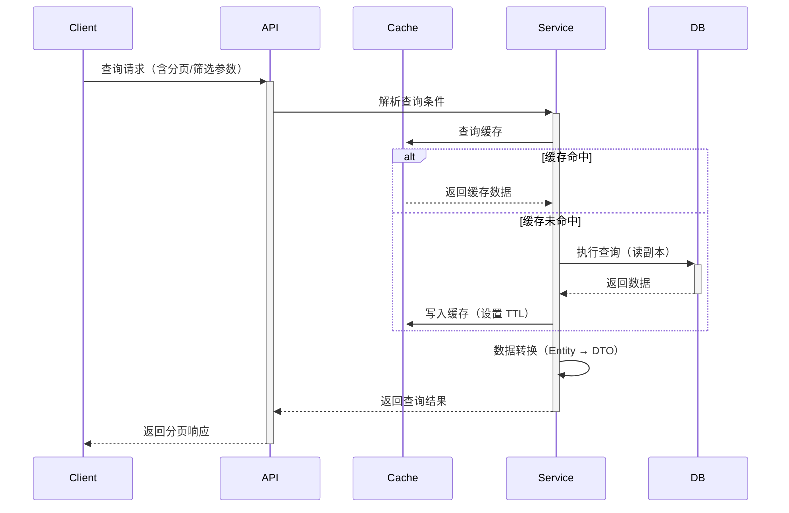

# 查询类架构模板 (Query Architecture Template)

## 模板元数据

- **场景类型**: query
- **适用用例**: 列表查询、详情查看、搜索、统计报表、数据导出查看
- **版本**: v1.0

## 1. 架构模式推荐

- **核心模式**: CQRS 读模型（Command Query Responsibility Segregation - 查询侧）
- **备选模式**: 标准 Repository 模式（简单查询）
- **搜索场景**: Elasticsearch / OpenSearch 全文检索
- **不推荐**: 在写模型上直接做复杂聚合查询

## 2. 技术栈推荐

### 2.1 数据库

- **主查询库**: MySQL / PostgreSQL 只读副本
- **搜索引擎**: Elasticsearch（复杂搜索场景）
- **数据仓库**: ClickHouse / StarRocks（统计报表场景）

### 2.2 缓存策略

- **L1 缓存**: 本地缓存（Caffeine / Guava，热点数据）
- **L2 缓存**: Redis（分布式缓存，列表/详情）
- **缓存模式**: Cache-Aside（标准查询）/ Read-Through（高频查询）
- **失效策略**: TTL + 主动失效（写操作触发）

### 2.3 消息队列（可选）

- **用途**: 缓存失效通知、搜索索引同步
- **推荐**: 仅在需要异步同步时使用

## 3. 组件清单

### 3.1 核心组件

| 组件名 | 职责 | 必需性 |
|--------|------|--------|
| QueryService | 查询服务（业务编排） | 必需 |
| QueryRepository | 查询数据访问 | 必需 |
| CacheManager | 缓存管理器 | 推荐 |
| PaginationHelper | 分页助手 | 推荐 |

### 3.2 搜索组件（按需）

| 组件名 | 职责 | 必需性 |
|--------|------|--------|
| SearchEngine | 全文搜索引擎封装 | 搜索场景必需 |
| IndexSynchronizer | 搜索索引同步器 | 搜索场景必需 |

### 3.3 统计组件（按需）

| 组件名 | 职责 | 必需性 |
|--------|------|--------|
| ReportGenerator | 报表生成器 | 报表场景必需 |
| AggregationService | 数据聚合服务 | 统计场景必需 |

## 4. 数据流设计



## 5. 接口契约模板

### 5.1 列表查询接口

```
GET /api/v1/{resources}?page=1&size=20&sort=created_at:desc&filter=status:active

响应体:
{
  "data": [...],
  "pagination": {
    "page": 1,
    "size": 20,
    "total": 150,
    "total_pages": 8
  }
}
```

### 5.2 详情查询接口

```
GET /api/v1/{resources}/{id}

响应体:
{
  "data": { ... },
  "metadata": {
    "cached": true,
    "cache_ttl": 300
  }
}
```

## 6. 安全考虑

- **数据权限**: 行级权限过滤（用户只能查询自己的数据）
- **字段脱敏**: 敏感字段（手机号、身份证）脱敏返回
- **频率限制**: 防止恶意爬取（Rate Limiting）
- **SQL 注入**: 参数化查询，禁止拼接 SQL

## 7. 性能优化

| 指标 | 目标 | 优化策略 |
|------|------|---------|
| P99 延迟 | < 200ms（缓存命中）/ < 500ms（未命中） | 多级缓存、索引优化 |
| 缓存命中率 | ≥ 80% | 合理 TTL、预热策略 |
| 并发查询 | ≥ 5000 QPS | 读写分离、连接池优化 |

### 查询优化检查清单

- [ ] 核心查询字段已建索引
- [ ] 避免 `SELECT *`，只查需要的字段
- [ ] 大列表查询使用游标分页（避免 OFFSET 深分页）
- [ ] 统计查询使用预聚合表或物化视图
- [ ] 慢查询监控已配置（> 500ms 告警）

## 8. 可观测性

### 8.1 关键指标

- 查询 QPS
- 查询延迟（P50/P95/P99）
- 缓存命中率
- 慢查询比例

### 8.2 告警阈值

- P99 > 1s
- 缓存命中率 < 70%
- 慢查询比例 > 5%

## 9. 测试策略

| 测试类型 | 重点场景 |
|----------|---------|
| 单元测试 | 查询条件解析、数据转换、缓存逻辑 |
| 集成测试 | 分页查询、筛选排序、缓存命中/未命中 |
| 性能测试 | 大数据量分页、并发查询、缓存穿透 |

## 10. 定制化参数

| 参数名 | 说明 | 默认值 |
|--------|------|--------|
| `DEFAULT_PAGE_SIZE` | 默认分页大小 | 20 |
| `MAX_PAGE_SIZE` | 最大分页大小 | 100 |
| `CACHE_TTL_LIST` | 列表缓存过期时间 | 300s |
| `CACHE_TTL_DETAIL` | 详情缓存过期时间 | 600s |
| `SLOW_QUERY_THRESHOLD` | 慢查询阈值 | 500ms |
