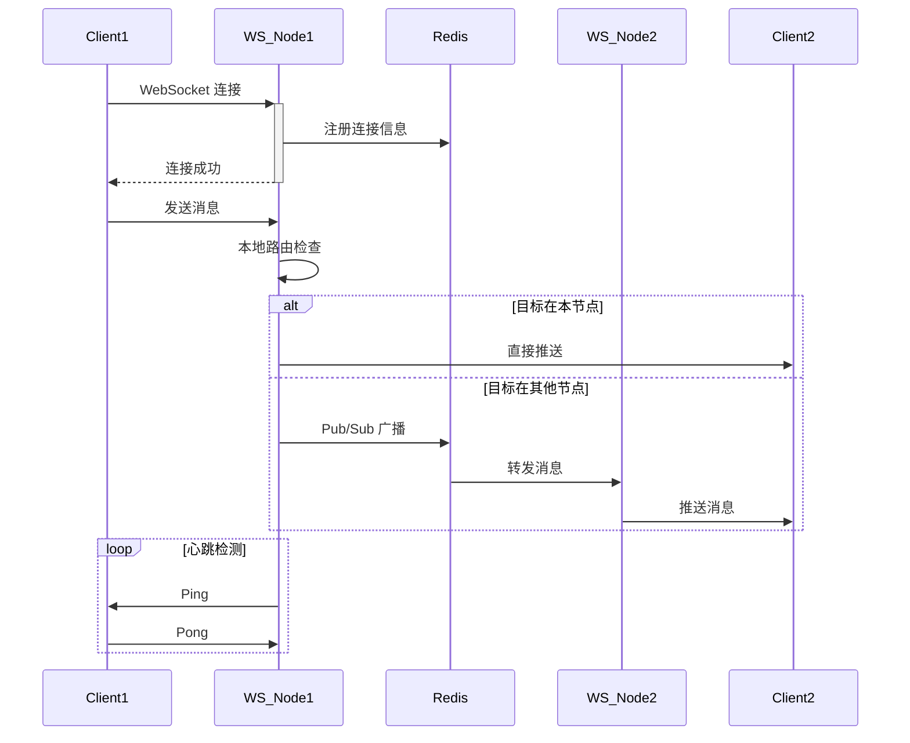

# 实时类架构模板 (Realtime Architecture Template)

## 模板元数据

- **场景类型**: realtime
- **适用用例**: 在线聊天、实时监控、协同编辑、在线游戏、实时推送
- **版本**: v1.0

## 1. 架构模式推荐

- **核心模式**: WebSocket 长连接 + 消息广播
- **备选模式**: SSE（Server-Sent Events，单向推送场景）
- **简化模式**: 长轮询（Long Polling，兼容性要求高）
- **不推荐**: 短轮询（Polling，延迟高、资源浪费）

## 2. 技术栈推荐

### 2.1 通信层

- **WebSocket 框架**: Netty / Spring WebSocket / Socket.IO
- **协议**: WebSocket（双向）/ SSE（单向推送）

### 2.2 数据库

- **消息持久化**: MongoDB / PostgreSQL（聊天记录等需要持久化的场景）
- **在线状态**: Redis（Hash / Sorted Set）

### 2.3 消息中间件

- **集群广播**: Redis Pub/Sub / Kafka / NATS
- **用途**: 跨节点消息分发、连接状态同步

### 2.4 缓存

- **连接管理**: 本地内存（连接映射）
- **在线状态**: Redis
- **消息缓存**: Redis（离线消息缓存）

## 3. 组件清单

### 3.1 核心组件

| 组件名 | 职责 | 必需性 |
|--------|------|--------|
| ConnectionManager | 连接管理器（建立/维护/销毁） | 必需 |
| MessageRouter | 消息路由器（点对点/房间/广播） | 必需 |
| HeartbeatManager | 心跳管理器 | 必需 |
| PresenceService | 在线状态服务 | 推荐 |

### 3.2 扩展组件

| 组件名 | 职责 | 必需性 |
|--------|------|--------|
| RoomManager | 房间/频道管理 | 按需 |
| OfflineMessageStore | 离线消息存储 | 按需 |
| RateLimiter | 消息频率限制 | 推荐 |

## 4. 数据流设计



## 5. 接口契约模板

### 5.1 WebSocket 连接

```
WS /ws/connect?token=xxx

消息格式 (JSON):
{
  "type": "message|join_room|leave_room|typing|heartbeat",
  "payload": { ... },
  "timestamp": 1234567890
}
```

### 5.2 HTTP 降级接口

```
GET /api/v1/realtime/messages?since=timestamp&room=xxx
POST /api/v1/realtime/messages (降级为 HTTP 发送)
```

## 6. 安全考虑

- **连接认证**: WebSocket 握手时 Token 验证
- **消息校验**: 消息格式和大小限制
- **频率限制**: 防止消息轰炸
- **连接限制**: 单用户最大连接数限制

## 7. 性能优化

| 指标 | 目标 | 优化策略 |
|------|------|---------|
| 消息延迟 | < 100ms（P99） | 本地路由优先、高效序列化 |
| 连接数 | ≥ 10000/节点 | Netty NIO、连接池 |
| 心跳间隔 | 30s | 服务端主动探测 |

## 8. 可观测性

### 关键指标

- 在线连接数
- 消息吞吐量（条/秒）
- 消息延迟（P50/P99）
- 连接断开率

### 告警阈值

- 连接断开率 > 5%/min
- 消息延迟 P99 > 500ms

## 9. 测试策略

| 测试类型 | 重点场景 |
|----------|---------|
| 单元测试 | 消息路由、心跳逻辑、连接管理 |
| 集成测试 | 多节点广播、断线重连、离线消息 |
| 压力测试 | 万级连接并发、消息洪峰 |

## 10. 定制化参数

| 参数名 | 说明 | 默认值 |
|--------|------|--------|
| `HEARTBEAT_INTERVAL` | 心跳间隔 | 30s |
| `HEARTBEAT_TIMEOUT` | 心跳超时（断开连接） | 90s |
| `MAX_CONNECTIONS_PER_USER` | 单用户最大连接数 | 5 |
| `MAX_MESSAGE_SIZE` | 最大消息大小 | 64KB |
| `OFFLINE_MESSAGE_TTL` | 离线消息保留时长 | 7d |
