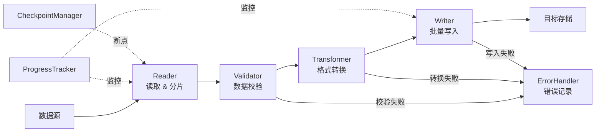

# 数据同步类架构模板 (Sync Architecture Template)

## 模板元数据

- **场景类型**: sync
- **适用用例**: 数据导入、数据导出、ETL、数据迁移、外部系统对接、批量处理
- **版本**: v1.0

## 1. 架构模式推荐

- **核心模式**: 批处理管道模式（Pipeline）
- **备选模式**: 事件驱动增量同步（CDC - Change Data Capture）
- **简化模式**: 定时全量同步（数据量小）
- **不推荐**: 实时逐条同步（大数据量场景）

## 2. 技术栈推荐

### 2.1 数据库

- **源/目标库**: 根据业务场景（MySQL/PostgreSQL/MongoDB/...）
- **中间存储**: 临时表或文件系统（staging area）
- **任务记录**: 独立 `sync_task` 表

### 2.2 文件处理

- **格式支持**: CSV、Excel、JSON、XML
- **大文件处理**: 流式读取（避免全量加载到内存）

### 2.3 消息队列

- **用途**: 任务调度、进度通知、错误重试
- **推荐**: RabbitMQ / Kafka（大数据量场景）

## 3. 组件清单

### 3.1 核心组件

| 组件名 | 职责 | 必需性 |
|--------|------|--------|
| SyncTaskManager | 同步任务管理器 | 必需 |
| DataReader | 数据读取器（支持多种数据源） | 必需 |
| DataTransformer | 数据转换器（格式映射/清洗） | 必需 |
| DataWriter | 数据写入器（目标数据源） | 必需 |
| ProgressTracker | 进度追踪器 | 必需 |

### 3.2 扩展组件

| 组件名 | 职责 | 必需性 |
|--------|------|--------|
| DataValidator | 数据校验器 | 推荐 |
| ErrorHandler | 错误处理器（跳过/重试/中止） | 推荐 |
| CheckpointManager | 断点续传管理器 | 推荐 |

## 4. 数据流设计



## 5. 接口契约模板

### 5.1 创建同步任务

```
POST /api/v1/sync/tasks
请求体: { "type": "import|export|migrate", "source": {...}, "target": {...}, "config": { "batch_size": 1000, "error_strategy": "skip|retry|abort" } }
```

### 5.2 查询任务进度

```
GET /api/v1/sync/tasks/{id}/progress
响应体: { "status": "running", "total": 10000, "processed": 5000, "failed": 12, "progress_pct": 50 }
```

## 6. 安全考虑

- **数据脱敏**: 导出时敏感字段脱敏
- **权限控制**: 导入/导出需要特定角色权限
- **文件安全**: 上传文件类型白名单、大小限制
- **审计日志**: 记录每次同步任务的操作人、数据范围

## 7. 性能优化

| 指标 | 目标 | 优化策略 |
|------|------|---------|
| 吞吐量 | ≥ 10000 条/秒 | 批量操作、并行分片 |
| 内存使用 | < 512MB | 流式处理、分页读取 |
| 断点恢复 | < 30s | Checkpoint 机制 |

## 8. 可观测性

### 关键指标

- 任务执行时长
- 数据处理速率（条/秒）
- 错误率
- 断点恢复次数

### 告警阈值

- 错误率 > 5%
- 任务超时（超过预估时间 2 倍）

## 9. 测试策略

| 测试类型 | 重点场景 |
|----------|---------|
| 单元测试 | 数据转换逻辑、校验规则、错误处理 |
| 集成测试 | 完整导入导出流程、断点续传 |
| 性能测试 | 大数据量（100 万条）、内存消耗 |
| 异常测试 | 数据源中断、格式错误、磁盘满 |

## 10. 定制化参数

| 参数名 | 说明 | 默认值 |
|--------|------|--------|
| `BATCH_SIZE` | 批量处理大小 | 1000 |
| `MAX_ERROR_RATE` | 最大允许错误率 | 5% |
| `CHECKPOINT_INTERVAL` | 断点保存间隔 | 每 5000 条 |
| `TASK_TIMEOUT` | 任务超时时间 | 4h |
| `PARALLEL_THREADS` | 并行处理线程数 | 4 |
