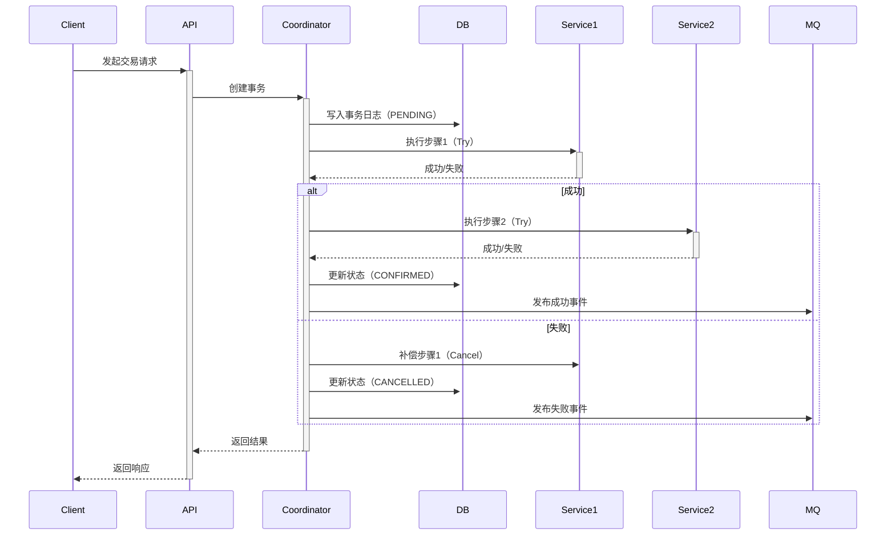

# 交易类架构模板 (Transaction Architecture Template)

## 模板元数据

- **场景类型**: transaction
- **适用用例**: 支付、订单、交易、结算、库存扣减、退款、转账
- **版本**: v1.0

## 1. 架构模式推荐

- **核心模式**: Saga 模式（分布式事务编排）
- **备选模式**: TCC（Try-Confirm-Cancel）
- **简化模式**: 本地事务（单服务场景）
- **不推荐**: 两阶段提交（2PC，性能瓶颈大）

## 2. 技术栈推荐

### 2.1 数据库

- **主库**: MySQL / PostgreSQL（ACID 支持）
- **事务日志**: 独立事务表记录（`transaction_log`）
- **隔离级别**: READ_COMMITTED（推荐）

### 2.2 缓存策略

- **缓存类型**: Redis（分布式锁、幂等记录）
- **缓存模式**: Cache-Aside（旁路缓存）
- **注意**: 交易核心流程不依赖缓存正确性

### 2.3 消息队列

- **用途**: 异步通知、补偿流程、事件发布
- **推荐**: RabbitMQ（支持事务消息）/ RocketMQ
- **消息可靠性**: 持久化 + ACK 机制

## 3. 组件清单

### 3.1 核心组件

| 组件名 | 职责 | 必需性 |
|--------|------|--------|
| TransactionCoordinator | 事务协调器（Saga 编排） | 必需 |
| CompensationHandler | 补偿处理器 | 跨服务时必需 |
| IdempotencyChecker | 幂等性校验器 | 必需 |
| TransactionLogger | 事务日志记录器 | 必需 |

### 3.2 数据组件

| 组件名 | 职责 | 必需性 |
|--------|------|--------|
| TransactionRepository | 事务数据仓储 | 必需 |
| TransactionEventPublisher | 事务事件发布器 | 推荐 |

### 3.3 集成组件（按需）

| 组件名 | 职责 | 必需性 |
|--------|------|--------|
| PaymentGateway | 支付网关（外部） | 按需 |
| InventoryService | 库存服务（内部） | 按需 |
| AccountService | 账户服务（内部） | 按需 |

## 4. 数据流设计



## 5. 接口契约模板

### 5.1 请求接口

```
POST /api/v1/transactions
Content-Type: application/json

请求体:
{
  "idempotency_key": "string (必需，幂等键)",
  "type": "string (交易类型)",
  "amount": "decimal (金额)",
  "source": "object (来源信息)",
  "target": "object (目标信息)",
  "metadata": "object (扩展信息)"
}

响应体:
{
  "transaction_id": "string",
  "status": "PENDING | CONFIRMED | CANCELLED",
  "created_at": "datetime"
}
```

### 5.2 回调接口

```
POST /api/v1/transactions/{txId}/callback
Content-Type: application/json

要求: 验证签名（必须）、幂等处理
```

## 6. 安全考虑

### 6.1 幂等性保证

- **方案**: 唯一业务键（订单号）+ Redis 分布式锁
- **超时**: 锁超时时间 > 事务处理时间
- **清理**: 定时清理过期幂等记录

### 6.2 并发控制

- **乐观锁**: 使用版本号（`version` 字段）
- **悲观锁**: 关键资源使用 `SELECT FOR UPDATE`
- **分布式锁**: 跨服务操作使用 Redis / ZooKeeper

### 6.3 数据一致性

- **最终一致性**: 通过补偿机制保证
- **对账机制**: 定时对账 + 差错处理
- **日志审计**: 全链路事务日志

## 7. 性能优化

| 指标 | 目标 | 优化策略 |
|------|------|---------|
| TPS | ≥ 1000 | 异步化非核心流程（通知、日志） |
| P99 延迟 | < 500ms | 数据库索引优化、减少网络往返 |
| 降级 | 限流 + 熔断 | 热点数据缓存（非核心） |

## 8. 可观测性

### 8.1 关键指标

- 交易成功率（%）
- 交易耗时（P50/P95/P99）
- 补偿触发次数
- 幂等拦截次数

### 8.2 告警阈值

- 成功率 < 99.5%
- P99 > 1s
- 补偿率 > 1%

### 8.3 追踪

- 分布式追踪: OpenTelemetry / SkyWalking
- 链路关键点: API → Coordinator → Services → DB/MQ

## 9. 测试策略

| 测试类型 | 重点场景 |
|----------|---------|
| 单元测试 | Coordinator 逻辑、补偿逻辑、幂等性校验 |
| 集成测试 | 正常交易流程、步骤失败+补偿、幂等性验证 |
| 并发测试 | 100 并发交易、分布式锁竞争 |
| 压力测试 | TPS 1000+ 场景、数据库慢查询 |

## 10. 定制化参数

| 参数名 | 说明 | 默认值 |
|--------|------|--------|
| `MAX_RETRY_TIMES` | 最大重试次数 | 3 |
| `TRANSACTION_TIMEOUT` | 事务超时时间 | 30s |
| `COMPENSATION_DELAY` | 补偿延迟时间 | 5s |
| `IDEMPOTENCY_EXPIRE` | 幂等记录过期时间 | 24h |
| `LOCK_TIMEOUT` | 分布式锁超时时间 | 10s |
