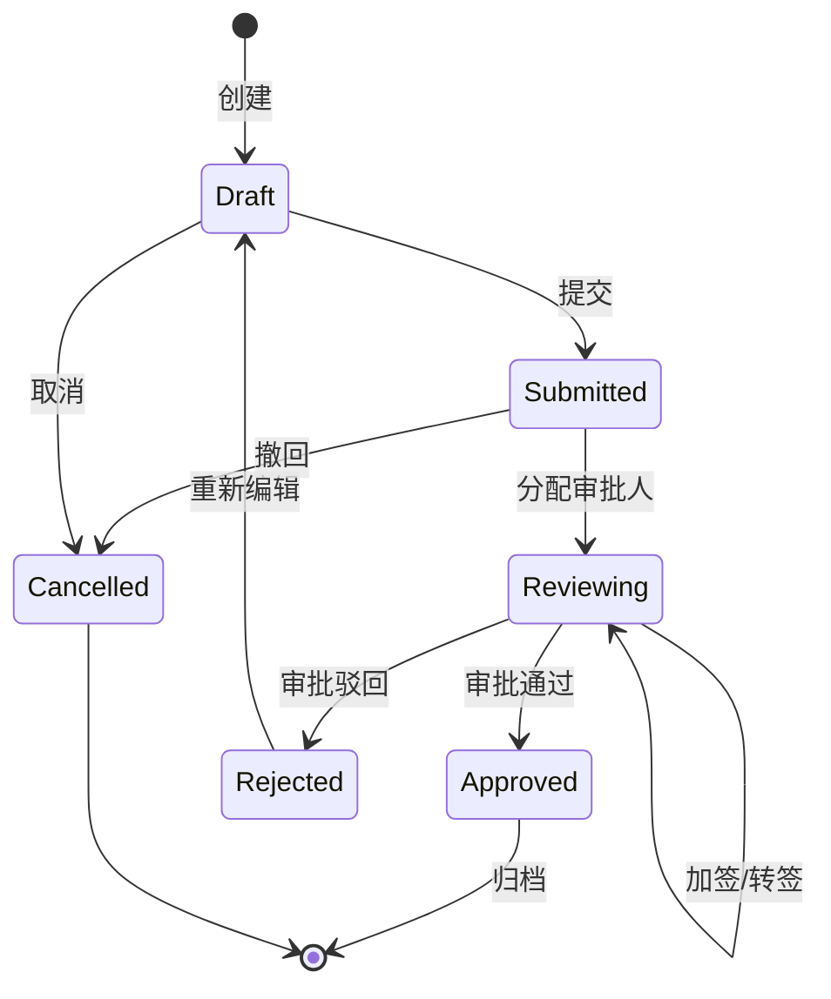

# 流程类架构模板 (Workflow Architecture Template)

## 模板元数据

- **场景类型**: workflow
- **适用用例**: 审批流程、工单流转、合同签署、请假审批、任务分配
- **版本**: v1.0

## 1. 架构模式推荐

- **核心模式**: 状态机模式（State Machine）
- **备选模式**: 流程引擎模式（如 Camunda / Flowable）
- **简化模式**: 简单状态枚举（节点数 ≤ 5）
- **不推荐**: 硬编码 if-else 状态流转

## 2. 技术栈推荐

### 2.1 数据库

- **主库**: MySQL / PostgreSQL
- **流程实例表**: 独立 `workflow_instance` 表
- **流程历史表**: `workflow_history`（审计追踪）

### 2.2 缓存策略

- **缓存类型**: Redis（流程定义缓存、待办列表缓存）
- **注意**: 流程状态变更必须写库，缓存仅用于加速读取

### 2.3 消息队列

- **用途**: 超时处理、节点通知、异步回调
- **推荐**: RabbitMQ / RocketMQ（延迟消息支持）

## 3. 组件清单

### 3.1 核心组件

| 组件名 | 职责 | 必需性 |
|--------|------|--------|
| WorkflowEngine | 流程引擎（状态流转核心） | 必需 |
| StateMachine | 状态机（定义合法流转路径） | 必需 |
| TaskAssigner | 任务分配器（确定处理人） | 必需 |
| WorkflowRepository | 流程数据仓储 | 必需 |

### 3.2 扩展组件

| 组件名 | 职责 | 必需性 |
|--------|------|--------|
| TimeoutHandler | 超时处理器 | 推荐 |
| NotificationDispatcher | 通知分发器 | 推荐 |
| WorkflowHistoryLogger | 流程历史记录器 | 必需 |
| ConditionEvaluator | 条件评估器（分支判断） | 按需 |

## 4. 数据流设计



## 5. 接口契约模板

### 5.1 发起流程

```
POST /api/v1/workflows
请求体: { "type": "leave_approval", "data": {...}, "initiator": "user_id" }
响应体: { "workflow_id": "...", "status": "DRAFT", "current_node": "..." }
```

### 5.2 审批操作

```
POST /api/v1/workflows/{id}/actions
请求体: { "action": "approve|reject|transfer", "comment": "...", "next_assignee": "..." }
```

### 5.3 查询待办

```
GET /api/v1/workflows/todo?assignee=user_id&status=pending
```

## 6. 安全考虑

- **操作权限**: 仅当前节点审批人可操作
- **数据权限**: 流程发起人和参与人可查看
- **审计日志**: 每次操作记录操作人、时间、动作、备注
- **防重提交**: 幂等性校验（同一节点同一操作）

## 7. 性能优化

| 指标 | 目标 | 优化策略 |
|------|------|---------|
| 状态流转延迟 | < 200ms | 状态机内存计算、异步通知 |
| 待办查询 | < 100ms | Redis 缓存待办列表 |
| 历史查询 | < 500ms | 历史表分区、索引优化 |

## 8. 可观测性

### 关键指标

- 流程平均处理时长
- 各节点平均停留时长
- 超时流程数量
- 驳回率

### 告警阈值

- 单节点停留 > 48h
- 超时率 > 10%

## 9. 测试策略

| 测试类型 | 重点场景 |
|----------|---------|
| 单元测试 | 状态机流转合法性、条件评估、任务分配 |
| 集成测试 | 完整审批流程、驳回重提、超时处理 |
| 边界测试 | 并发审批、会签场景、循环审批 |

## 10. 定制化参数

| 参数名 | 说明 | 默认值 |
|--------|------|--------|
| `NODE_TIMEOUT` | 节点超时时间 | 48h |
| `MAX_REJECT_TIMES` | 最大驳回次数 | 3 |
| `REMINDER_INTERVAL` | 催办间隔 | 24h |
| `HISTORY_RETENTION` | 历史记录保留时长 | 365d |
