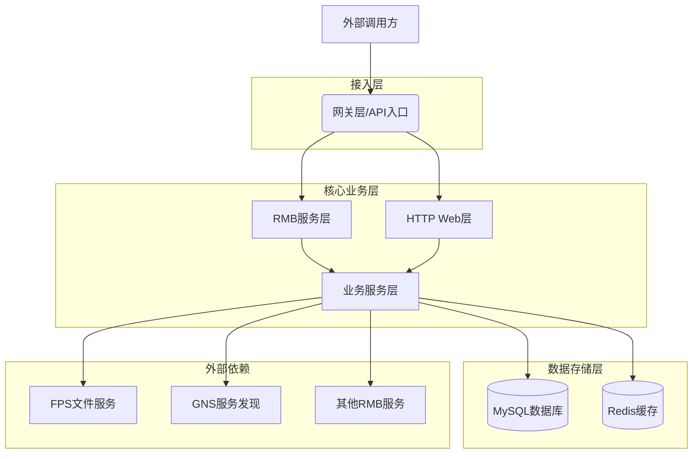

# 系统概览

## 技术栈说明

### 后端框架及版本
- **Java版本**: JDK 8+
- **Spring Boot**: 3.5.5
- **MyBatis**: 3.x (集成Spring Boot Starter)
- **Mumble Framework**: 4.1.1 (Webank内部微服务框架)
- **Gradle**: 7.x 构建工具

### 前端框架及版本
- 本系统主要为后端服务，提供RMB和HTTP API接口
- 内置简单的Web管理界面用于系统维护

### 数据库类型及版本
- **主数据库**: MySQL 8.0+
- **连接池**: HikariCP (内置在Spring Boot中)
- **数据访问**: MyBatis ORM框架

### 中间件列表
- **缓存服务**: Redis Cluster (Webank内部Redis服务)
- **文件存储**: FPS (File Process Service) 文件存储服务
- **消息通信**: RMB (Remote Message Bus) 内部服务通信
- **服务注册**: GNS (Global Name Service) 服务发现
- **配置管理**: WeConf (Webank内部配置中心)
- **监控告警**: Mumble Monitor (内置监控)

## 整体架构图



## 系统特性

### 高可用性
- 基于Mumble框架的分布式部署
- 数据库主从读写分离
- Redis集群缓存支持
- 服务自动注册与发现
- 负载均衡和故障转移

### 可扩展性
- 微服务架构设计
- 水平扩展能力
- 异步处理机制
- 批量任务支持

### 安全性
- RMB服务认证授权
- 数据传输加密
- 敏感信息脱敏
- 访问权限控制

## 部署环境

### 开发环境 (DEV/SIT)
- 单实例部署
- 本地MySQL数据库
- 本地Redis缓存
- 集成测试环境配置

### 测试环境 (UAT/QA)
- 多实例负载均衡
- 测试数据库集群
- 测试Redis集群
- 完整的服务依赖

### 生产环境 (PRD)
- 高可用集群部署
- MySQL主从复制
- Redis集群部署
- 完整的监控告警体系
- 自动化运维支持

## 项目结构说明

```
ecif-core/
├── build.gradle              # 项目构建配置
├── gradle.properties         # 版本配置
├── src/
│   ├── main/
│   │   ├── java/cn/webank/ecif/
│   │   │   ├── base/         # 基础公共组件
│   │   │   ├── batch/        # 批量处理模块
│   │   │   ├── personal/     # 个人客户核心业务
│   │   │   ├── rmb/          # RMB服务接口
│   │   │   ├── server/       # 服务启动配置
│   │   │   ├── tranlog/      # 交易日志模块
│   │   │   └── web/          # Web控制器
│   │   └── resources/
│   │       ├── application.properties  # 主配置文件
│   │       ├── env/          # 环境配置
│   │       ├── mapper/       # MyBatis映射文件
│   │       └── sql/          # 数据库脚本
│   └── test/                 # 测试代码
└── docs/                     # 文档目录
    └── architecture/         # 架构文档
