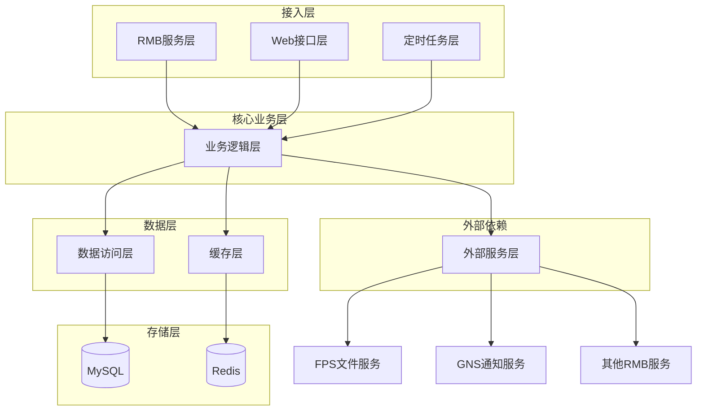

# 核心模块

## 1. 模块职责说明

### 1.1 个人客户管理模块 (personal)
负责个人客户信息的全生命周期管理，包括客户基本信息、身份信息、联系信息等。这是系统的核心业务模块。

**核心职责**:
- 个人客户信息的增删改查
- 客户身份认证和验证
- 客户信息同步和广播
- 客户状态管理
- 产品权限管理
- 客户证照信息管理

### 1.2 RMB服务模块 (rmb)
提供内部系统间通信的RMB服务接口，是ECIF-Core对外提供服务能力的主要方式。基于Webank的Mumble框架实现。

**核心职责**:
- 标准化的服务接口定义
- 服务调用的安全认证
- 服务监控和日志记录
- 异常处理和熔断机制
- 服务治理和负载均衡

### 1.3 批量处理模块 (batch)
处理大批量数据的批量作业，包括数据同步、文件处理、定时任务等。支持高并发和大数据量处理。

**核心职责**:
- 批量数据处理和同步
- 文件上传下载处理
- 定时任务调度执行
- 批量作业监控管理
- 数据修补和迁移

### 1.4 基础公共模块 (base)
提供系统级的公共组件和服务，包括缓存、工具类、常量定义等。为其他模块提供基础支撑。

**核心职责**:
- 公共工具类和常量
- 缓存服务封装
- 基础数据访问组件
- 系统配置管理
- 公共DTO和实体定义

### 1.5 交易日志模块 (tranlog)
记录系统交易日志，提供审计和追踪能力。用于系统监控和问题排查。

**核心职责**:
- 交易流水记录
- 操作日志审计
- 异常交易追踪
- 日志查询分析
- 系统请求注册

### 1.6 Web接口模块 (web)
提供HTTP RESTful API接口，供外部系统调用。主要用于系统管理和维护功能。

**核心职责**:
- HTTP请求处理
- 文件上传下载
- 系统管理接口
- 健康检查接口
- 数据修补接口

## 2. 代码结构图

```
src/main/java/cn/webank/ecif/
├── base/                           # 基础公共组件
│   ├── cache/                      # 缓存管理
│   ├── common/                     # 公共DTO、工具类、常量
│   │   ├── dto/                    # 数据传输对象
│   │   ├── key/                    # 系统常量定义
│   │   └── util/                   # 工具类
│   ├── integration/                # 集成组件
│   │   └── dao/                    # 数据访问对象
│   └── serivce/                    # 基础服务
├── batch/                          # 批量处理模块
│   ├── common/                     # 批量处理公共组件
│   ├── integration/                # 批量处理集成组件
│   ├── patch/                      # 数据修补工具
│   ├── service/                    # 批量处理服务
│   └── web/                        # 批量处理Web接口
├── personal/                       # 个人客户核心业务
│   ├── common/                     # 个人客户公共组件
│   │   ├── dto/                    # 个人客户DTO
│   │   ├── entity/                 # 个人客户实体
│   │   └── util/                   # 个人客户工具类
│   ├── integration/                # 个人客户集成组件
│   │   ├── dao/                    # 数据访问对象
│   │   └── sao/                    # 服务访问对象
│   └── service/                    # 个人客户服务
├── rmb/                            # RMB服务接口
│   ├── common/                     # RMB公共组件
│   └── impl/                       # RMB服务实现
├── server/                         # 服务启动配置
├── tranlog/                        # 交易日志模块
│   ├── common/                     # 交易日志公共组件
│   ├── integration/                # 交易日志集成组件
│   └── service/                    # 交易日志服务
└── web/                            # Web控制器
    └── InitService/                # 初始化服务
```

## 3. 关键类/函数说明

| 类名/函数名 | 职责说明 | 调用关系 |
|------------|----------|----------|
| PersonalClientPojoService | 个人客户核心业务逻辑处理 | 调用PersonalClientDao进行数据访问 |
| QueryClientInfoPojoService | 客户信息查询RMB服务实现 | 实现QueryClientInfoService接口 |
| FpsPojoService | 文件处理服务封装 | 调用FPS客户端进行文件操作 |
| EcifPatchController | 系统管理HTTP接口 | 提供系统维护和管理功能 |
| WebProxy | Web代理服务 | 处理文件上传和RMB服务转发 |
| SequenceRangeServiceImpl | 序列号生成服务 | 为业务提供唯一序列号 |
| RedisDaoImpl | Redis数据访问封装 | 提供缓存操作接口 |

## 4. 数据流向说明

### 4.1 客户信息查询流程
1. 外部系统通过RMB调用QueryClientInfoService
2. QueryClientInfoPojoService接收请求并处理
3. 查询Redis缓存，命中则直接返回
4. 缓存未命中则查询MySQL数据库
5. 将结果写入Redis缓存并返回给调用方

### 4.2 客户信息更新流程
1. 外部系统通过RMB调用ModifyInfoService
2. ModifyInfoPojoService处理更新请求
3. 更新MySQL数据库中的客户信息
4. 清除相关的Redis缓存
5. 通过GNS广播变更信息给其他系统

### 4.3 文件上传处理流程
1. 客户端通过HTTP POST上传文件到WebProxy
2. WebProxy将文件保存到临时目录
3. 调用FpsService将文件上传到FPS文件服务
4. 获取文件ID和哈希值
5. 调用FaceService保存文件关联信息

## 5. 模块间关系

### 5.1 整体架构关系图



### 5.2 核心调用链路

1. **查询客户信息调用链**:
   RMB服务 → QueryClientInfoPojoService → Redis缓存/MySQL数据库 → 返回结果

2. **更新客户信息调用链**:
   RMB服务 → ModifyInfoPojoService → MySQL数据库 → Redis缓存清理 → GNS广播

3. **文件处理调用链**:
   Web接口 → WebProxy → FpsService → FPS文件服务 → FaceService

### 5.3 数据流向说明

- **读操作**: RMB/Web → Service → Cache/DB → 返回结果
- **写操作**: RMB/Web → Service → DB → Cache更新 → 外部服务通知
- **批量操作**: 定时任务 → Batch Service → DB/File → 外部服务

### 5.4 依赖关系矩阵

| 模块 | personal | rmb | batch | base | tranlog | web |
|------|----------|-----|-------|------|---------|-----|
| personal | - | 依赖 | 依赖 | 依赖 | 依赖 | 依赖 |
| rmb | 依赖 | - | 依赖 | 依赖 | 依赖 | - |
| batch | 依赖 | 依赖 | - | 依赖 | 依赖 | 依赖 |
| base | - | 依赖 | 依赖 | - | 依赖 | 依赖 |
| tranlog | 依赖 | 依赖 | 依赖 | 依赖 | - | 依赖 |
| web | 依赖 | 依赖 | 依赖 | 依赖 | 依赖 | - |

### 5.5 协作模式说明

- **同步调用**: RMB服务调用、Web接口调用
- **异步处理**: 文件上传、GNS广播、定时任务
- **事件驱动**: 数据变更广播、缓存更新

## 6. 设计模式应用

### 6.1 服务层设计模式
- **Facade模式**: PersonalClientPojoService作为客户信息管理的外观
- **Strategy模式**: 不同查询类型的处理策略
- **Template Method模式**: 批量处理任务的模板方法

### 6.2 数据访问设计模式
- **DAO模式**: 各种数据访问对象封装
- **Repository模式**: Redis缓存访问封装
- **Active Record模式**: DTO对象包含基本的CRUD操作

### 6.3 集成设计模式
- **Adapter模式**: 外部服务适配器封装
- **Proxy模式**: Web代理服务
- **Observer模式**: GNS消息订阅通知

## 7. 性能优化策略

### 7.1 缓存策略
- Redis一级缓存，减少数据库访问
- 缓存预热和更新机制
- 缓存穿透和雪崩防护

### 7.2 数据库优化
- 连接池管理
- 索引优化
- 分表分库策略

### 7.3 并发处理
- 线程池管理
- 异步处理机制
- 分布式锁控制
