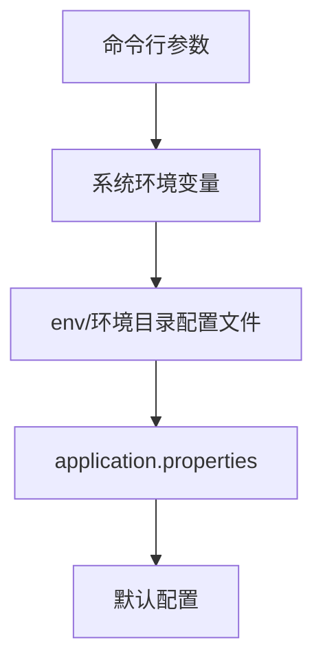

# 配置管理

## 1. 环境配置分析

### 1.1 环境分类
ECIF-Core系统支持多种运行环境，每种环境有不同的配置：

- **开发环境 (dev)**: 本地开发和单元测试使用
- **系统集成测试环境 (sit)**: 功能测试和集成测试使用
- **用户验收测试环境 (uat)**: 用户验收测试使用
- **准生产环境 (qdy)**: 预发布环境
- **生产环境 (prd)**: 正式生产环境

### 1.2 核心环境变量和配置项

#### 1.2.1 系统基础配置
| 配置项 | 说明 | 默认值 |
|--------|------|--------|
| server.port | 服务端口号 | 8080 |
| spring.application.name | 应用名称 | ecif-core |
| spring.profiles.active | 激活的环境 | sit |
| logging.level.* | 日志级别配置 | INFO |

#### 1.2.2 数据库配置
| 配置项 | 说明 | 默认值 |
|--------|------|--------|
| spring.datasource.url | 数据库连接URL | jdbc:mysql://localhost:3306/ecif |
| spring.datasource.username | 数据库用户名 | ecif_user |
| spring.datasource.password | 数据库密码 | encrypted_password |
| spring.datasource.driver-class-name | 数据库驱动 | com.mysql.cj.jdbc.Driver |
| spring.datasource.hikari.maximum-pool-size | 连接池最大连接数 | 20 |

#### 1.2.3 Redis配置
| 配置项 | 说明 | 默认值 |
|--------|------|--------|
| spring.redis.host | Redis主机地址 | localhost |
| spring.redis.port | Redis端口 | 6379 |
| spring.redis.password | Redis密码 |  |
| spring.redis.database | Redis数据库索引 | 0 |
| spring.redis.timeout | Redis超时时间 | 2000ms |

#### 1.2.4 Mumble框架配置
| 配置项 | 说明 | 默认值 |
|--------|------|--------|
| mumble.appid | 应用ID | ECIFCORE |
| mumble.system | 系统标识 | ECIF |
| mumble.subsystem | 子系统标识 | ecif-core |
| mumble.domain | 域名 | RPD |

## 2. 配置文件说明

### 2.1 主配置文件 (application.properties)
```properties
# 应用基础配置
spring.application.name=ecif-core
server.port=8080
spring.profiles.active=sit

# 日志配置
logging.config=classpath:log4j2.xml
logging.level.cn.webank.ecif=DEBUG
logging.level.org.springframework=WARN

# 数据库配置
spring.datasource.url=jdbc:mysql://localhost:3306/ecif?useUnicode=true&characterEncoding=utf8&zeroDateTimeBehavior=convertToNull&useSSL=false&serverTimezone=GMT%2B8
spring.datasource.username=${DB_USERNAME:ecif_user}
spring.datasource.password=${DB_PASSWORD:encrypted_password}
spring.datasource.driver-class-name=com.mysql.cj.jdbc.Driver
spring.datasource.hikari.maximum-pool-size=20
spring.datasource.hikari.minimum-idle=5
spring.datasource.hikari.connection-timeout=30000

# Redis配置
spring.redis.host=${REDIS_HOST:localhost}
spring.redis.port=${REDIS_PORT:6379}
spring.redis.password=${REDIS_PASSWORD:}
spring.redis.database=${REDIS_DB:0}
spring.redis.timeout=2000ms

# MyBatis配置
mybatis.mapper-locations=classpath*:mapper/*.xml
mybatis.configuration.map-underscore-to-camel-case=true
mybatis.configuration.use-generated-keys=true
mybatis.configuration.default-executor-type=reuse

# Mumble配置
mumble.appid=ECIFCORE
mumble.system=ECIF
mumble.subsystem=ecif-core
mumble.domain=RPD

# RMB客户端配置
rmb.client.request-timeout=3000
rmb.client.connect-timeout=1000
rmb.client.read-timeout=5000

# 文件上传配置
spring.servlet.multipart.max-file-size=10MB
spring.servlet.multipart.max-request-size=10MB

# 缓存配置
ecif.cache.expire-time=3600
ecif.cache.null-value-expire-time=300
```

### 2.2 环境特定配置

#### 2.2.1 开发环境配置 (env/dev/application.properties)
```properties
# 开发环境数据库
spring.datasource.url=jdbc:mysql://localhost:3306/ecif_dev?useUnicode=true&characterEncoding=utf8&zeroDateTimeBehavior=convertToNull&useSSL=false&serverTimezone=GMT%2B8
spring.datasource.username=dev_user
spring.datasource.password=dev_password

# 开发环境Redis
spring.redis.host=localhost
spring.redis.port=6379
spring.redis.database=1

# 开发环境日志级别
logging.level.cn.webank.ecif=DEBUG
logging.level.org.springframework=INFO

# 开发环境Mumble配置
mumble.appid=ECIFCORE_DEV
```

#### 2.2.2 SIT环境配置 (env/sit/application.properties)
```properties
# SIT环境数据库
spring.datasource.url=jdbc:mysql://sit-db:3306/ecif_sit?useUnicode=true&characterEncoding=utf8&zeroDateTimeBehavior=convertToNull&useSSL=false&serverTimezone=GMT%2B8
spring.datasource.username=sit_user
spring.datasource.password=encrypted_sit_password

# SIT环境Redis
spring.redis.host=sit-redis
spring.redis.port=6379
spring.redis.database=0

# SIT环境日志级别
logging.level.cn.webank.ecif=INFO
logging.level.org.springframework=WARN

# SIT环境Mumble配置
mumble.appid=ECIFCORE_SIT
```

#### 2.2.3 生产环境配置 (env/prd/application.properties)
```properties
# 生产环境数据库
spring.datasource.url=${DB_URL:jdbc:mysql://prd-db-cluster:3306/ecif_prd?useUnicode=true&characterEncoding=utf8&zeroDateTimeBehavior=convertToNull&useSSL=false&serverTimezone=GMT%2B8}
spring.datasource.username=${DB_USERNAME:prd_user}
spring.datasource.password=${DB_PASSWORD:encrypted_prd_password}

# 生产环境Redis
spring.redis.host=${REDIS_HOST:prd-redis-cluster}
spring.redis.port=${REDIS_PORT:6379}
spring.redis.password=${REDIS_PASSWORD:encrypted_redis_password}
spring.redis.database=${REDIS_DB:0}

# 生产环境日志级别
logging.level.cn.webank.ecif=WARN
logging.level.org.springframework=ERROR

# 生产环境Mumble配置
mumble.appid=ECIFCORE_PRD
```

### 2.3 服务器环境配置 (server.env)
```bash
#!/bin/bash
# 服务器环境变量配置

# JVM配置
export JAVA_OPTS="-Xms2g -Xmx4g -XX:+UseG1GC -XX:MaxGCPauseMillis=200 -XX:+HeapDumpOnOutOfMemoryError"

# 应用配置
export SPRING_PROFILES_ACTIVE=prd
export SERVER_PORT=8080

# 数据库配置
export DB_URL="jdbc:mysql://prd-db-cluster:3306/ecif_prd?useUnicode=true&characterEncoding=utf8&zeroDateTimeBehavior=convertToNull&useSSL=false&serverTimezone=GMT%2B8"
export DB_USERNAME="prd_user"
export DB_PASSWORD="encrypted_prd_password"

# Redis配置
export REDIS_HOST="prd-redis-cluster"
export REDIS_PORT="6379"
export REDIS_PASSWORD="encrypted_redis_password"
export REDIS_DB="0"

# 日志配置
export LOG_PATH="/data/logs/ecif-core"
export LOG_LEVEL="WARN"
```

## 3. 配置加载机制

### 3.1 配置优先级顺序


配置优先级从上到下递减，高优先级的配置会覆盖低优先级的配置。

### 3.2 配置注入方式

#### 3.2.1 @Value注解注入
```java
@Component
public class ConfigService {
    
    @Value("${ecif.cache.expire-time:3600}")
    private int cacheExpireTime;
    
    @Value("${spring.application.name}")
    private String appName;
    
    @Value("${server.port}")
    private int serverPort;
}
```

#### 3.2.2 @ConfigurationProperties注入
```java
@ConfigurationProperties(prefix = "ecif.database")
@Data
@Component
public class DatabaseConfig {
    private String url;
    private String username;
    private String password;
    private int maxPoolSize = 20;
    private int minIdle = 5;
}
```

#### 3.2.3 Environment对象注入
```java
@Service
public class DynamicConfigService {
    
    @Autowired
    private Environment environment;
    
    public String getProperty(String key) {
        return environment.getProperty(key);
    }
    
    public String getProperty(String key, String defaultValue) {
        return environment.getProperty(key, defaultValue);
    }
}
```

### 3.3 配置类的设计模式

#### 3.3.1 配置持有者模式
```java
@Component
public class AppConfigHolder {
    
    private static AppConfigHolder instance;
    
    @Value("${app.name}")
    private String appName;
    
    @PostConstruct
    public void init() {
        instance = this;
    }
    
    public static String getAppName() {
        return instance.appName;
    }
}
```

#### 3.3.2 配置工厂模式
```java
@Configuration
public class ConfigFactory {
    
    @Bean
    @ConfigurationProperties(prefix = "ecif.redis")
    public RedisConfig redisConfig() {
        return new RedisConfig();
    }
    
    @Bean
    @ConfigurationProperties(prefix = "ecif.database")
    public DatabaseConfig databaseConfig() {
        return new DatabaseConfig();
    }
}
```

## 4. 安全管理

### 4.1 密码加密机制
使用RSA非对称加密保护敏感配置：

```properties
# 加密后的数据库密码
spring.datasource.password={RSA}encrypted_base64_string

# 加密后的Redis密码
spring.redis.password={RSA}encrypted_redis_password
```

### 4.2 敏感配置项识别
以下配置项属于敏感信息，需要特别保护：

- 数据库用户名和密码
- Redis密码
- Mumble框架密钥
- 外部服务访问凭证
- 加密私钥

### 4.3 配置访问控制策略

#### 4.3.1 配置权限管理
```java
@Secured("ROLE_ADMIN")
@RestController
@RequestMapping("/config")
public class ConfigManagementController {
    
    @Autowired
    private ConfigService configService;
    
    @GetMapping("/reload")
    public ResponseEntity<String> reloadConfig() {
        configService.refreshConfig();
        return ResponseEntity.ok("配置已重新加载");
    }
}
```

#### 4.3.2 配置审计日志
```java
@Aspect
@Component
public class ConfigAccessAudit {
    
    private static final Logger logger = LoggerFactory.getLogger(ConfigAccessAudit.class);
    
    @Around("@annotation(ConfigAudit)")
    public Object auditConfigAccess(ProceedingJoinPoint joinPoint) throws Throwable {
        String methodName = joinPoint.getSignature().getName();
        Object[] args = joinPoint.getArgs();
        
        logger.info("配置访问: 方法={}, 参数={}", methodName, Arrays.toString(args));
        
        long startTime = System.currentTimeMillis();
        Object result = joinPoint.proceed();
        long endTime = System.currentTimeMillis();
        
        logger.info("配置访问完成: 方法={}, 耗时={}ms", methodName, (endTime - startTime));
        
        return result;
    }
}
```

## 5. 配置更新机制

### 5.1 动态刷新
支持配置热更新的属性需要添加`@RefreshScope`注解：

```java
@Component
@RefreshScope
public class DynamicConfigService {
    
    @Value("${app.feature.toggle:false}")
    private boolean featureToggle;
    
    @Value("${app.cache.ttl:3600}")
    private int cacheTtl;
    
    // getters
}
```

### 5.2 配置监听
监听配置变化事件：

```java
@Component
public class ConfigChangeListener {
    
    private static final Logger logger = LoggerFactory.getLogger(ConfigChangeListener.class);
    
    @EventListener
    public void onRefreshScopeRefreshed(RefreshScopeRefreshedEvent event) {
        // 配置刷新后执行的操作
        logger.info("配置已刷新: {}", event.getName());
        // 重新初始化相关服务
        reinitializeServices();
    }
    
    private void reinitializeServices() {
        // 重新初始化需要的业务服务
    }
}
```

### 5.3 配置版本管理
```java
@Entity
@Table(name = "ecif_config_history")
public class ConfigHistory {
    
    @Id
    @GeneratedValue(strategy = GenerationType.IDENTITY)
    private Long id;
    
    private String configKey;
    private String oldValue;
    private String newValue;
    private String operator;
    private Date updateTime;
    private String environment;
    
    // getters and setters
}
```

## 6. 不同环境配置示例

### 6.1 本地开发环境
```bash
export SPRING_PROFILES_ACTIVE=dev
export DB_HOST=localhost
export DB_PORT=3306
export DB_NAME=ecif_dev
export DB_USERNAME=dev_user
export DB_PASSWORD=dev_password
export REDIS_HOST=localhost
export REDIS_PORT=6379
```

### 6.2 Docker环境
```dockerfile
ENV SPRING_PROFILES_ACTIVE=docker
ENV DB_HOST=mysql
ENV DB_PORT=3306
ENV DB_NAME=ecif
ENV DB_USERNAME=app_user
ENV DB_PASSWORD=encrypted_app_password
ENV REDIS_HOST=redis
ENV REDIS_PORT=6379
```

### 6.3 Kubernetes环境
```yaml
apiVersion: v1
kind: ConfigMap
metadata:
  name: ecif-core-config
data:
  SPRING_PROFILES_ACTIVE: k8s
  DB_HOST: mysql-service
  DB_NAME: ecif_prd
  REDIS_HOST: redis-cluster

---
apiVersion: v1
kind: Secret
metadata:
  name: ecif-core-secret
type: Opaque
data:
  DB_USERNAME: base64编码的用户名
  DB_PASSWORD: base64编码的加密密码
  REDIS_PASSWORD: base64编码的Redis密码
