# Ease Coding

## Overview

ease-coding 用于"实现/重构/代码审查"的编码最佳实践参考入口：面向生产代码，强调可落地的改动建议（不仅是原则），并按语言与常见框架给出指引。

## When to Use

**Use when:**
- 代码审查发现问题（正确性/安全/性能/可读性/可测试性/可维护性）
- 需要实现具体功能代码（新增接口、服务方法、数据访问、异步/并发逻辑）
- 需要重构提升可测试性或降低复杂度（保持行为不变）

**Do NOT use:**
- 主要目标生成测试代码 → `ease-testing`
- 主要目标架构/用例/领域分析 → `ease-architecture` / `ease-analysis`

## Quick Reference

| 你正在做什么 | 先做什么 | 读哪份参考 |
|---|---|---|
| 代码审查（/ease:code-review） | 识别语言/框架；追踪至少 1 条调用链 | `references/coding-<lang>.md` |
| 实现新功能（/ease:flow-3-implement） | 明确验收标准 + 错误处理 + 回归点 | `references/coding-<lang>.md`（必要时联动 `ease-testing`） |
| 重构提升可测试性 | 先补/加回归测试，保证行为不变 | `references/coding-<lang>.md` |
| MumbleSDK 项目开发 | 先确认是否为 MumbleSDK，再遵循框架约束 | **必须优先调用 `mumblesdk` skill** |

## Language Detection Flowchart

```dot
digraph coding_workflow {
    start [shape=ellipse, label="Start coding task"];
    "Detect language" [shape=diamond];
    "MumbleSDK detected?" [shape=diamond];
    "Load mumblesdk skill" [shape=box, style=filled, fillcolor=lightyellow];
    "Load coding-<lang>.md" [shape=box];
    "Read guidance" [shape=box];
    "Apply changes" [shape=box];

    start → "Detect language";
    "Detect language" → "MumbleSDK detected?";
    "MumbleSDK detected?" → "Load mumblesdk skill" [label="Yes"];
    "MumbleSDK detected?" → "Load coding-<lang>.md" [label="No"];
    "Load mumblesdk skill" → "Read guidance";
    "Load coding-<lang>.md" → "Read guidance";
    "Read guidance" → "Apply changes";
}
```

## Project Type Detection (MUST Execute First)

### Language/Framework Detection

| 语言 | 特征文件 | 参考 |
|---|---|---|
| Java (MumbleSDK) | `pom.xml`/`build.gradle` + `mumble-sdk` 依赖 | **先调用 `mumblesdk` skill** |
| Java (通用) | `pom.xml`/`build.gradle` | `references/coding-java.md` |
| Go | `go.mod` | `references/coding-go.md` |
| Python | `requirements.txt` 或 `pyproject.toml` | `references/coding-python.md` |
| TypeScript | `package.json` + `tsconfig.json` | `references/coding-typescript.md` |

### MumbleSDK Detection

检测条件（满足任一）：
- `pom.xml`/`build.gradle` 包含 `mumble-sdk` 依赖
- 源码检测到 `MumbleAbstractBaseController`、`AbstractSimpleDAO` 等特征类

**MumbleSDK 项目必须优先调用 `mumblesdk` skill**

## Core Principles (Review Checklist)

避免输出"教科书式原则"，强制落到可执行审查/改动：

1. **正确性**：边界条件/空值/并发语义/幂等性/时序
2. **错误处理**：失败路径可观测性（日志/指标）、可恢复、错误信息可行动
3. **安全性**：输入校验、鉴权、注入风险（SQL/XSS/命令/反序列化）
4. **性能**：N+1、低效查询、无界循环、过大拷贝；优化必须基于证据
5. **可读性**：命名表达意图、深层嵌套/重复分支/魔法常量
6. **可测试性**：依赖可注入、副作用可隔离、稳定测试切面
7. **可维护性**：职责清晰、改动局部化、避免不必要抽象

### Refactor Rules

- 先有回归点：必要时先补测试再动结构
- 小步变更：每次只做一个可解释的改动
- 遵循项目现有风格与分层

## Output Verification

代码变更后必须验证：

### LSP Diagnostics (Critical)
- [ ] **类型检查**: 运行 LSP 诊断，确保无类型错误
- [ ] **语法检查**: 确保代码可编译/解析
- [ ] **Import 检查**: 确保所有 import 有效

### Functional Verification
- [ ] **单元测试**: 新增/修改的代码有对应测试覆盖
- [ ] **回归测试**: 现有测试仍然通过
- [ ] **行为一致性**: 重构前后行为保持一致

### Style Verification
- [ ] **格式合规**: 符合项目 linter/formatter 规则
- [ ] **命名规范**: 变量/函数/类命名符合项目约定

## Edge Cases

| 场景 | 处理策略 |
|------|----------|
| **多语言混合项目** | 按文件扩展名分批处理，每次专注一种语言；建立语言边界映射 |
| **无特征文件** | 询问用户项目语言，或基于文件扩展名推测；如仍不确定，列出常见选项供选择 |
| **特征文件异常** | 提示用户检查配置文件，提供示例配置；如损坏，建议从模板重建 |
| **代码 >1000 行** | 分批审查，每次聚焦一个函数/类；优先审查核心业务逻辑 |
| **检测不到语言** | 使用 `find . -type f \( -name "*.java" -o -name "*.go" -o -name "*.py" -o -name "*.ts" \) \| head -20` 辅助检测 |

## Language Detection Priority

当多个特征文件存在时，按以下优先级检测：
1. **用户指定**: 用户明确指定的语言和框架
2. **文件扩展名**: 当前编辑文件的后缀名
3. **Java**: `pom.xml` / `build.gradle`（企业级项目常见）
4. **TypeScript**: `package.json` + `tsconfig.json`
5. **Go**: `go.mod`
6. **Python**: `requirements.txt` / `pyproject.toml`

## Common Mistakes

| 错误 | 症状 | 修复 |
|---|---|---|
| 只谈 SOLID/模式，不给具体改动 | 输出像教材，无法落地 | 强制给出 ≥3 个具体改动建议（含风险/收益/替代方案） |
| 只看局部实现，不追踪调用链 | 误判正确性/性能/安全 | 至少追踪 1 条调用路径（入口 → 核心逻辑 → 外部依赖） |
| 无证据就建议"加缓存/加线程/加异步" | 可能引入竞态/一致性问题 | 先给指标/基线/瓶颈位置，再给方案与回滚策略 |
| 为了"过类型检查"使用 any/ignore | 引入隐患，后续扩散 | 禁止类型逃逸；改为补齐类型建模或重构接口边界 |

## See Also

### Upstream (Input Sources)
- `ease-spec/SKILL.md` - Provides tasks.md for implementation
- `ease-architecture/SKILL.md` - Provides architecture decisions
- `ease-framework-code/SKILL.md` - Provides framework skeleton
- `commands/flow-3-implement.md` - Command interface
- `commands/code-review.md` - Command interface

### Downstream (Output Consumers)
- `ease-testing/SKILL.md` - Generates tests for implemented code
- `git-commit/SKILL.md` - Commits the code changes
- `ease-poc/SKILL.md` - Validates technical approaches

### Alternatives
- `mumblesdk/SKILL.md` - For MumbleSDK enterprise framework (use instead for MumbleSDK projects)
- `quick-develop/SKILL.md` - For small changes without full architecture

### References
- `references/project-type-detection.md` - Optional detection scripts
- `references/coding-java.md` - Java coding guidelines
- `references/coding-go.md` - Go coding guidelines
- `references/coding-python.md` - Python coding guidelines
- `references/coding-typescript.md` - TypeScript coding guidelines
