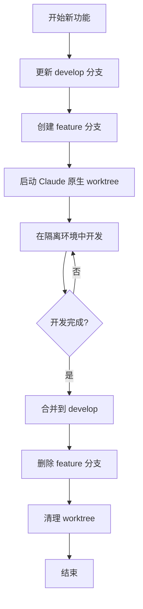

# Feature 分支工作流

本文档详细描述 Feature 分支的完整工作流程，配合 Claude Code 原生 Worktree 实现开发隔离。

## 流程概览



## 目录结构

```
project/
├── .git/
├── .claude/
│   └── worktrees/             # Claude Code 原生 worktree 目录
│       └── feature-user-auth/ # feature/user-auth 分支 worktree
├── src/
└── ...
```

## 详细步骤

### 1. 创建 Feature 分支

#### 命令

```bash
/ease:gitflow feature start <feature-name>
# 示例：/ease:gitflow feature start user-auth
```

#### 执行步骤

1. **检查环境**：确认当前目录是 Git 仓库
2. **更新 develop**：拉取最新的 develop 分支
3. **创建分支**：从 develop 创建 `feature/<feature-name>` 分支

#### 输出示例

```
✅ Feature 分支创建成功！

📋 信息：
   分支名称：feature/user-auth
   基于：develop (abc1234)

🚀 启动 Claude Code Worktree 进行开发：

   方式 1: 使用 Claude Code 原生 worktree（推荐）
   ─────────────────────────────────────────
   claude -w feature/user-auth

   方式 2: 传统切换
   ─────────────────────────────────────────
   git checkout feature/user-auth
   claude

   方式 3: 手动创建 worktree
   ─────────────────────────────────────────
   git worktree add .claude/worktrees/feature-user-auth feature/user-auth
   cd .claude/worktrees/feature-user-auth
   claude

💡 提示：使用 claude -w 会自动创建隔离的开发环境
```

#### 验证点

- [ ] develop 分支已更新到最新
- [ ] feature 分支已从 develop 创建
- [ ] 分支命名符合 `feature/<name>` 规范

### 2. 开发阶段

#### 在 Claude 原生 Worktree 中工作

```bash
# 启动 Claude Code 原生 worktree
claude -w feature/user-auth

# Claude 会自动：
# 1. 在 .claude/worktrees/feature-user-auth/ 创建隔离环境
# 2. 检出 feature/user-auth 分支
# 3. 启动新的 Claude 会话
```

#### 正常的 Git 操作

```bash
# 在 worktree 中正常工作
git add .
git commit -m "feat: implement user authentication"

# 推送到远程（首次需要设置上游）
git push -u origin feature/user-auth

# 后续推送
git push
```

#### 同步 develop 更新

```bash
# 在 worktree 中
git fetch origin

# 变基到最新的 develop（推荐）
git rebase origin/develop

# 或者合并（如果有多人协作）
git merge origin/develop
```

#### 并行开发多个 Feature

```bash
# 终端 1：开发 feature/user-auth
claude -w feature/user-auth

# 终端 2：开发 feature/payment（需要先创建分支）
/ease:gitflow feature start payment
claude -w feature/payment

# 每个 worktree 完全隔离，互不干扰
```

### 3. 完成 Feature 分支

#### 命令

```bash
/ease:gitflow feature finish <feature-name>
# 示例：/ease:gitflow feature finish user-auth
```

#### 执行步骤

1. **检查状态**：确认工作区干净，所有更改已提交
2. **更新 develop**：拉取最新的 develop 分支
3. **合并分支**：将 feature 分支合并到 develop（--no-ff 保留分支历史）
4. **推送远程**：推送 develop 到远程
5. **清理分支**：删除本地和远程的 feature 分支

#### 清理 Worktree

完成 feature 后，需要手动清理 Claude 原生 worktree：

```bash
# 查看所有 worktree
git worktree list

# 删除对应的 worktree
git worktree remove .claude/worktrees/feature-user-auth

# 或使用 cleanup 命令自动清理已合并分支的 worktree
/ease:gitflow cleanup
```

#### 验证点

- [ ] 所有代码已提交
- [ ] 已合并到 develop
- [ ] develop 已推送到远程
- [ ] feature 分支已删除
- [ ] worktree 已清理

### 4. 查看状态

#### 命令

```bash
/ease:gitflow status
```

#### 输出示例

```
📋 GitFlow 状态

### 分支概览
| 分支类型 | 分支名 | 状态 | Claude Worktree |
|---------|-------|------|-----------------|
| feature | user-auth | 开发中 | .claude/worktrees/feature-user-auth |
| feature | payment | 已合并 | - |
| release | v1.2.0 | 测试中 | .claude/worktrees/release-v1.2.0 |

### Claude 原生 Worktree
运行 `git worktree list` 查看详情

### 清理建议
/ease:gitflow cleanup
```

## 最佳实践

### 1. 保持分支更新

定期从 develop 同步更新，避免最后合并时出现大量冲突：

```bash
# 在 worktree 中
git fetch origin
git rebase origin/develop
```

### 2. 小步提交

- 每个提交做一件事
- 提交信息使用 Conventional Commits 格式
- 示例：`feat: add login API endpoint`

### 3. 代码审查

在 `feature finish` 之前，建议通过 Pull Request 进行代码审查：

```bash
# 推送分支
git push -u origin feature/<feature-name>

# 在 GitHub/GitLab 创建 PR
# 审查通过后再执行 feature finish
```

### 4. 及时清理

定期清理已完成的 worktree：

```bash
# 查看所有 worktree
git worktree list

# 清理无效引用
git worktree prune

# 或使用 cleanup 命令
/ease:gitflow cleanup
```

## 常见问题

### Q: claude -w 创建了随机分支名怎么办？

Claude Code 原生 worktree 如果不指定分支名，会创建随机分支名（如 `claude/focused-pare`）。

**解决方法**：先用 GitFlow 创建分支，再指定分支名启动 worktree：

```bash
# 1. 先创建 GitFlow 分支
/ease:gitflow feature start user-auth

# 2. 指定分支名启动 worktree
claude -w feature/user-auth
```

### Q: 如何处理长期运行的 feature 分支？

建议定期 rebase 到最新的 develop，保持代码同步：

```bash
git fetch origin
git rebase origin/develop
git push --force-with-lease  # 如果已推送到远程
```

### Q: 多人协作同一个 feature 怎么办？

避免 rebase，改用 merge：

```bash
git fetch origin
git merge origin/develop
```

### Q: worktree 目录不小心删除了怎么办？

```bash
# 清理无效的 worktree 引用
git worktree prune

# 重新创建 worktree
claude -w feature/<feature-name>
```

### Q: 如何在 feature 间共享代码？

```bash
# 如果 feature-b 依赖 feature-a 的代码
git fetch origin
git cherry-pick <commit-from-feature-a>
```
