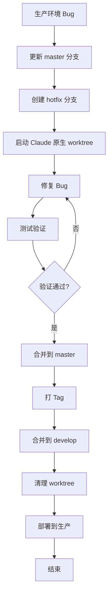

# Hotfix 分支工作流

本文档详细描述 Hotfix 分支的完整工作流程，用于紧急修复生产环境中的关键问题，配合 Claude Code 原生 Worktree 实现开发隔离。

## 流程概览



## 目录结构

```
project/
├── .git/
├── .claude/
│   └── worktrees/             # Claude Code 原生 worktree 目录
│       └── hotfix-login-fix/  # hotfix/login-fix 分支 worktree
├── src/
└── ...
```

## 详细步骤

### 1. 创建 Hotfix 分支

#### 命令
```bash
/ease:gitflow hotfix start <name>
# 示例：/ease:gitflow hotfix start critical-login-fix
```

#### 执行步骤

1. **更新 master**：拉取最新的 master 分支
2. **创建分支**：从 master 创建 `hotfix/<name>` 分支
3. **记录版本**：获取当前生产版本号

#### 输出示例

```
🚨 Hotfix 分支创建成功！

📋 信息：
   分支名称：hotfix/critical-login-fix
   基于：master (abc1234)
   当前版本：v1.2.0

🚀 启动 Claude Code Worktree 进行紧急修复：

   方式 1: 使用 Claude Code 原生 worktree（推荐）
   ─────────────────────────────────────────
   claude -w hotfix/critical-login-fix

   方式 2: 传统切换
   ─────────────────────────────────────────
   git checkout hotfix/critical-login-fix
   claude

⚠️ 注意事项：
   1. 仅修复紧急问题，不添加新功能
   2. 修复后需要充分测试
   3. 修复完成后会自动递增 patch 版本
```

### 2. 修复阶段

#### 启动隔离环境

```bash
# 启动 Claude Code 原生 worktree
claude -w hotfix/critical-login-fix
```

#### 工作原则

- ⚡ **快速修复**：专注于解决问题，不做额外改动
- 🎯 **最小改动**：只修改必要的代码
- 🧪 **充分测试**：确保修复有效且不引入新问题
- 📝 **清晰记录**：详细的提交信息和修复说明

#### 修复步骤

```bash
# 在 worktree 中

# 1. 定位问题
# - 查看日志
# - 复现问题
# - 分析原因

# 2. 修复代码
# 编辑相关文件...

# 3. 本地测试
npm test  # 或其他测试命令

# 4. 提交修复
git add .
git commit -m "fix: resolve critical login authentication failure

- Root cause: session token validation was skipped under high load
- Solution: add mutex lock for token validation process
- Impact: affects all users trying to login

Fixes #123"
```

#### 提交信息规范

```
fix: <简短描述>

- Root cause: <根本原因>
- Solution: <解决方案>
- Impact: <影响范围>

Fixes #<issue-number>
```

### 3. 完成 Hotfix 分支

#### 命令
```bash
/ease:gitflow hotfix finish <name> [--version <new-version>]
# 示例：/ease:gitflow hotfix finish critical-login-fix
# 或指定版本：/ease:gitflow hotfix finish critical-login-fix --version v1.2.1
```

#### 执行步骤

1. **检查状态**：确认工作区干净
2. **计算版本**：自动递增 patch 版本（如未指定）
3. **合并到 master**：将 hotfix 分支合并到 master
4. **创建 Tag**：创建版本标签
5. **推送 master**：推送 master 和 tag 到远程
6. **合并到 develop**：将 hotfix 分支合并到 develop
7. **推送 develop**：推送 develop 到远程
8. **清理分支**：删除 hotfix 分支

#### 清理 Worktree

```bash
# 删除对应的 worktree
git worktree remove .claude/worktrees/hotfix-critical-login-fix

# 或使用 cleanup 命令
/ease:gitflow cleanup
```

#### 输出示例

```
🎉 Hotfix v1.2.1 完成！

📋 已完成操作：
   ✓ 合并到 master
   ✓ 创建 Tag v1.2.1
   ✓ 合并到 develop
   ✓ 推送到远程
   ✓ 清理分支

🚀 紧急部署：
   现在可以从 Tag v1.2.1 进行生产部署

📢 后续步骤：
   1. 部署到生产环境
   2. 验证修复效果
   3. 通知相关人员
   4. 更新问题跟踪系统
```

#### 验证点
- [ ] Bug 已修复
- [ ] 测试通过
- [ ] 已合并到 master
- [ ] 已创建版本 Tag
- [ ] 已合并回 develop
- [ ] hotfix 分支已删除
- [ ] worktree 已清理

## 紧急情况处理

### 场景 1：修复过程中发现需要更多时间

如果 hotfix 需要更长时间，考虑：

1. **临时回滚**：回滚到上一个稳定版本
2. **功能开关**：禁用有问题的功能
3. **转为 feature**：如果不紧急，转为正常 feature 开发

```bash
# 回滚到上一个版本
git checkout master
git revert HEAD
git push origin master
# 重新部署上一个稳定版本
```

### 场景 2：Hotfix 期间 master 有更新

```bash
# 在 hotfix worktree 中
git fetch origin

# Rebase 到最新的 master
git rebase origin/master

# 解决可能的冲突
# 继续完成 hotfix
```

### 场景 3：同时存在多个 Hotfix

避免同时进行多个 hotfix，如果必须：

1. 按优先级排序
2. 一个完成后再开始下一个
3. 或者合并到同一个 hotfix 分支

## 最佳实践

### 1. 响应时间

| 严重程度 | 响应时间 | 示例 |
|---------|---------|------|
| P0 - 紧急 | < 1 小时 | 系统完全不可用 |
| P1 - 高 | < 4 小时 | 核心功能不可用 |
| P2 - 中 | < 24 小时 | 非核心功能问题 |
| P3 - 低 | 下个发布 | 轻微问题 |

### 2. 沟通机制

- 立即通知团队 Lead
- 更新状态页面（如有）
- 定期更新修复进度
- 完成后发送修复报告

### 3. 事后复盘

每次 hotfix 后进行复盘：

```markdown
## Hotfix 复盘报告

### 基本信息
- 问题发现时间：
- 问题解决时间：
- 总耗时：
- 影响范围：

### 问题分析
- 根本原因：
- 为什么没有在测试中发现：

### 改进措施
- 短期：
- 长期：

### 经验教训
-
```

## 常见问题

### Q: 如何处理 hotfix 与正在进行的 release 冲突？

将 hotfix 合并到 release 分支而不是 develop：

```bash
claude -w release/v1.2.0
# 在 release worktree 中
git merge --no-ff hotfix/critical-fix
```

### Q: 如何取消一个 hotfix？

```bash
# 删除 worktree
git worktree remove .claude/worktrees/hotfix-<name>

# 删除分支
git branch -D hotfix/<name>
git push origin --delete hotfix/<name>
```

### Q: hotfix 完成后如何验证生产环境？

1. 从新 Tag 部署到预发布环境
2. 运行自动化测试
3. 手动验证修复效果
4. 确认无副作用后部署到生产
