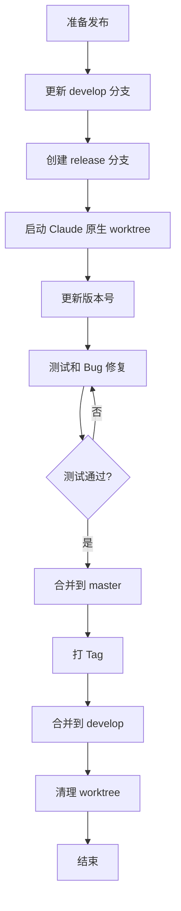

# Release 分支工作流

本文档详细描述 Release 分支的完整工作流程，配合 Claude Code 原生 Worktree 实现开发隔离。

## 流程概览



## 目录结构

```
project/
├── .git/
├── .claude/
│   └── worktrees/             # Claude Code 原生 worktree 目录
│       └── release-v1.2.0/    # release/v1.2.0 分支 worktree
├── src/
└── ...
```

## 详细步骤

### 1. 创建 Release 分支

#### 命令
```bash
/ease:gitflow release start <version>
# 示例：/ease:gitflow release start v1.2.0
```

#### 执行步骤

1. **验证版本号**：确认版本号格式为 `vX.Y.Z`
2. **更新 develop**：拉取最新的 develop 分支
3. **创建分支**：从 develop 创建 `release/<version>` 分支

#### 输出示例

```
✅ Release 分支创建成功！

📋 信息：
   分支名称：release/v1.2.0
   基于：develop (abc1234)
   版本号：v1.2.0

🚀 启动 Claude Code Worktree 进行发布准备：

   方式 1: 使用 Claude Code 原生 worktree（推荐）
   ─────────────────────────────────────────
   claude -w release/v1.2.0

   方式 2: 传统切换
   ─────────────────────────────────────────
   git checkout release/v1.2.0
   claude

⚠️ 注意事项：
   1. 仅进行 Bug 修复和版本号更新
   2. 不添加新功能
   3. 完成后执行：/ease:gitflow release finish v1.2.0
```

#### 验证点
- [ ] develop 分支已更新到最新
- [ ] release 分支已从 develop 创建
- [ ] 版本号格式正确

### 2. 测试和 Bug 修复阶段

#### 启动隔离环境

```bash
# 启动 Claude Code 原生 worktree
claude -w release/v1.2.0
```

#### 允许的更改

在 release 分支中只允许以下类型的更改：

- ✅ Bug 修复
- ✅ 文档更新
- ✅ 版本号调整
- ❌ 新功能开发
- ❌ 大规模重构

#### 提交规范

```bash
# 在 worktree 中

# Bug 修复
git commit -m "fix: resolve login page crash on Safari"

# 文档更新
git commit -m "docs: update CHANGELOG for v1.2.0"

# 版本调整
git commit -m "chore: update release notes"
```

### 3. 完成 Release 分支

#### 命令
```bash
/ease:gitflow release finish <version>
# 示例：/ease:gitflow release finish v1.2.0
```

#### 执行步骤

1. **检查状态**：确认工作区干净
2. **合并到 master**：将 release 分支合并到 master
3. **创建 Tag**：创建版本标签
4. **推送 master**：推送 master 和 tag 到远程
5. **合并到 develop**：将 release 分支合并回 develop
6. **推送 develop**：推送 develop 到远程
7. **清理分支**：删除 release 分支

#### 清理 Worktree

```bash
# 删除对应的 worktree
git worktree remove .claude/worktrees/release-v1.2.0

# 或使用 cleanup 命令
/ease:gitflow cleanup
```

#### 验证点
- [ ] 所有测试通过
- [ ] 已合并到 master
- [ ] 已创建版本 Tag
- [ ] 已合并回 develop
- [ ] release 分支已删除
- [ ] worktree 已清理

## 版本号管理

### 语义化版本（SemVer）

```
v<主版本号>.<次版本号>.<修订号>
v    MAJOR  .  MINOR  .  PATCH

示例：v1.2.3
```

- **MAJOR**：不兼容的 API 变更
- **MINOR**：向下兼容的功能新增
- **PATCH**：向下兼容的问题修复

### 版本号文件更新

支持的版本号文件：

1. **package.json** (Node.js)
2. **pom.xml** (Maven)
3. **build.gradle** (Gradle)
4. **VERSION** 文件

## CHANGELOG 管理

### 建议格式

```markdown
# Changelog

## [1.2.0] - 2024-01-15

### Added
- 新增用户认证功能
- 添加支付网关集成

### Changed
- 优化数据库查询性能
- 更新依赖版本

### Fixed
- 修复登录页面在 Safari 上的崩溃问题

### Security
- 修复 XSS 漏洞
```

## 最佳实践

### 1. 发布检查清单

在执行 `release finish` 之前：

- [ ] 所有自动化测试通过
- [ ] 代码审查完成
- [ ] CHANGELOG 已更新
- [ ] README 已更新（如有必要）
- [ ] API 文档已更新（如有必要）
- [ ] 数据库迁移脚本已准备

### 2. 发布频率

- 定期发布（如每两周）
- 避免在周五发布
- 保持发布流程可重复

### 3. 回滚计划

每次发布前准备回滚计划：

```bash
# 记录上一个稳定版本
LAST_STABLE_TAG=v1.1.0

# 如需回滚
git checkout ${LAST_STABLE_TAG}
# 重新部署
```

## 常见问题

### Q: 如何在 release 期间处理紧急 bug？

在 release worktree 中直接修复：

```bash
claude -w release/v1.2.0
# 在 worktree 中修复 bug
git commit -m "fix: critical bug in payment flow"
```

### Q: release 期间 develop 有了新的提交怎么办？

release 分支不需要合并 develop 的新提交。这些提交会在 release finish 时通过合并回 develop 来处理。

### Q: 如何取消一个 release？

```bash
# 删除 worktree
git worktree remove .claude/worktrees/release-v1.2.0

# 删除分支
git branch -D release/v1.2.0
git push origin --delete release/v1.2.0
```
