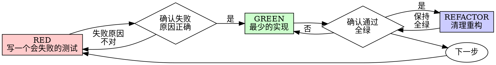

# 测试驱动开发（TDD）— 用“先失败的测试”锁定行为

先写测试。看着它失败。再写最少的代码让它通过。

> **定位**：这是一个“强制性工作流”技能，目标不是写出更多测试，而是让每一行生产代码都拥有可验证的行为证据。

> ⚠️ **TDD 铁律（不可协商）**：`NO PRODUCTION CODE WITHOUT A FAILING TEST FIRST`。
> 如果你没有亲眼看着测试以“正确原因”失败，你就无法确认它真的在测你想测的东西。

> **规则的字面就是规则的精神**：任何“我遵循精神但不遵循字面”的解释，都是在为跳过 TDD 找借口。

> **`<EXTREMELY-IMPORTANT>`**
> 如果你觉得有 1% 的可能性需要使用该技能，你**必须**使用它。

## 概述

这份技能把 TDD 约束成可审计、可复制的工程流程（而不是“测试很重要”的口号）。它要求：

- 🔴 **RED**：写一个会失败的测试，表达“应该发生什么”
- ✅ **验证 RED**：运行测试，确认以“功能缺失”而非“测试报错”失败
- 🟢 **GREEN**：写最少实现让测试通过（不加额外功能）
- ✅ **验证 GREEN**：保持全绿，输出干净（无错误、无警告）
- 🔧 **REFACTOR**：仅在全绿下清理结构，不引入新行为

## 适用范围

### 适用场景

**总是使用：**
- 新功能
- Bug 修复
- 重构
- 行为变更

### 不适用场景

以下情况允许例外，但必须先征求你的人类搭档同意：

- 一次性原型（探索代码要丢弃，然后用 TDD 重新开始）
- 生成代码（由生成器/框架保证，不适合手写测试驱动）
- 纯配置变更（建议使用更贴近配置验证的流程/命令）

脑子里冒出“就这一次跳过 TDD”这种想法？停下来。这是在自我合理化。

## 铁律

```
没有先失败的测试，就不要写生产代码
```

如果你在写测试之前就写了代码：删掉它，从头开始。

**没有例外：**
- 不要保留它作为"参考"
- 不要在编写测试时"调整"它
- 不要看它
- 删除意味着删除

从测试出发重新实现。就这么简单。

## 工作流程

### Phase 1: RED — 编写失败的测试

**目标**：用最小测试明确描述“应该发生什么”。

**执行步骤**：
1. 只描述一个行为（名字里出现 “and” 就拆开）
2. 先写断言（期待什么）再写准备数据（怎么触发）
3. 尽量使用真实对象/真实流程（除非不得不，否则别 mock）

### Phase 2: 验证 RED — 亲眼看着它失败

**目标**：证明测试真的能抓到“缺失的行为”。

**执行步骤**：
1. 用 `test_command` 运行目标测试（建议仅跑该文件/用例）
2. 失败必须是 `fail`（断言失败），不是 `error`（环境/语法/用法报错）
3. 失败原因必须是“功能缺失/行为不符合”，而不是测试写错

### Phase 3: GREEN — 最小实现

**目标**：只写足够让当前失败测试通过的实现。

**执行步骤**：
1. 不做超出测试驱动的“顺手优化/顺手加功能”
2. 避免过度抽象与 YAGNI（新能力等下一个 RED）

### Phase 4: 验证 GREEN — 保持全绿

**目标**：证明改动没有引入回归。

**执行步骤**：
1. 再次运行目标测试，确认通过
2. 运行必要的相关测试集（至少当前包/模块）
3. 输出应干净（无错误、无警告）

### Phase 5: REFACTOR — 清理结构

**目标**：只改“结构”，不改“行为”。

**执行步骤**：
1. 移除重复、改进命名、提取助手
2. 每次重构后保持全绿

### Phase 6: 重复

为下一个行为写下一个会失败的测试，继续循环。

## 红-绿-重构（可视化）



## 示例

### 🔴 RED - 编写失败的测试

写一个最小的测试，明确描述“应该发生什么”。

<Good>

```typescript
test('重试失败的操作3次', async () => {
  let attempts = 0;
  const operation = () => {
    attempts++;
    if (attempts < 3) throw new Error('fail');
    return 'success';
  };

  const result = await retryOperation(operation);

  expect(result).toBe('success');
  expect(attempts).toBe(3);
});
```

命名清晰，测真实行为，只测一件事

</Good>

<Bad>

```typescript
test('retry works', async () => {
  const mock = jest.fn()
    .mockRejectedValueOnce(new Error())
    .mockRejectedValueOnce(new Error())
    .mockResolvedValueOnce('success');
  await retryOperation(mock);
  expect(mock).toHaveBeenCalledTimes(3);
});
```

命名含糊，测的是 mock，不是代码的真实行为

</Bad>

**要求：**
- 一个行为
- 名称清晰
- 尽量用真实代码（除非不得不，否则别 mock）

### ✅ 验证 RED - 看着它失败

**必须做。绝不跳过。**

```bash
npm test path/to/test.test.ts
```

确认：
- 测试失败（fail），而不是报错（error）
- 失败信息符合预期
- 失败原因是“功能缺失”，而不是拼写/用法错误

**测试通过？** 说明你测到的是既有行为，测试写错了，修正测试。

**测试报错？** 先把报错修好，反复运行，直到它以“正确的原因”失败。

### 🟢 GREEN - 最小代码

写最简单的代码，让测试通过。

<Good>

```typescript
async function retryOperation<T>(fn: () => Promise<T>): Promise<T> {
  for (let i = 0; i < 3; i++) {
    try {
      return await fn();
    } catch (e) {
      if (i === 2) throw e;
    }
  }
  throw new Error('unreachable');
}
```

刚好够用、能通过测试

</Good>

<Bad>

```typescript
async function retryOperation<T>(
  fn: () => Promise<T>,
  options?: {
    maxRetries?: number;
    backoff?: 'linear' | 'exponential';
    onRetry?: (attempt: number) => void;
  }
): Promise<T> {
  // YAGNI
}
```

过度工程

</Bad>

不要额外加功能、不要顺手重构别的代码、也不要做任何不被测试驱动的“改进”。

### ✅ 验证 GREEN - 看着它通过

**必须做。**

```bash
npm test path/to/test.test.ts
```

确认：
- 测试通过
- 其他测试仍然通过
- 输出干净（无错误、无警告）

**测试失败？** 修代码，不要改测试。

**其他测试失败？** 立刻修，别拖。

### 🔧 REFACTOR - 清理

只在“全绿”之后做：
- 移除重复
- 改进名称
- 提取助手

保持测试全绿。不要引入任何新行为。

### 重复

为下一个功能写下一个会失败的测试。

## 质量标准

### 好的测试

| 质量 | 好 | 坏 |
|---------|------|-----|
| **极小** | 只测一件事。名字里出现“and”？拆开。 | `test('验证电子邮件和域和空白')` |
| **清晰** | 名字能读出行为 | `test('test1')` |
| **表达意图** | 展示期望的 API 形状 | 让人看不出代码应该做什么 |

## 为什么顺序重要

**“我之后再写测试来验证它能用”**

代码写完后再补的测试往往会立刻通过。立刻通过并不能证明任何东西：
- 可能测试错误的东西
- 可能测的是实现细节，而不是行为
- 可能漏掉你没想到的边界情况
- 你从未见过它抓到 bug

测试优先会强迫你先看到测试失败，从而证明：它确实在测试某些东西。

**“我已经手动把所有边界情况都测过了”**

手动测试是临时的、随缘的。你以为自己都测到了，但其实：
- 没有“你到底测过什么”的记录
- 代码更改时无法重新运行
- 在压力下很容易漏掉情况
- “我试的时候能用”≠“覆盖全面”

自动化测试是系统化的：它们每次都用同样的方式运行。

**“删掉 X 小时的工作太浪费了”**

这是沉没成本谬误。时间已经过去了，你现在只有两种选择：
- 删除并用 TDD 重写（再 X 小时，信心高）
- 保留代码、之后再补测试（30 分钟，信心低，容易出 bug）

真正的“浪费”是保留你无法信任的代码。没有真实测试支撑的“能跑”代码就是技术债务。

**“TDD 太教条了，务实就得灵活”**

TDD 是务实的：
- 在提交之前发现 bug（比之后调试更快）
- 防止回归（测试立即捕获破坏）
- 记录行为（测试显示如何使用代码）
- 启用重构（自由更改，测试捕获破坏）

所谓“务实”的捷径 = 去线上调试 = 更慢。

**“先写实现再补测试也能达到同样目的——重精神不重仪式”**

不对。先实现后补测试是在回答“这段代码现在做了什么？”。先测试后实现是在回答“它应该做什么？”。

先实现后补测试会被你的实现带偏：你测试的是你写出来的东西，而不是需求；你验证的是你记得的边界情况，而不是那些本该被发现的。

先测试会在实现之前强迫你把边界情况想清楚。后补测试只是在验证你“是不是都记得”（而你通常记不全）。

花 30 分钟补测试 ≠ TDD。你可能拿到了一点覆盖率，但失去了“证明测试真的有用”的关键证据。

## 常见合理化

| 借口 | 现实 |
|--------|---------|
| "太简单，不用测" | 简单代码也会坏。写个测试只要 30 秒。 |
| "我之后再测" | 立刻通过的测试证明不了任何东西。 |
| "先实现后写测试也一样" | 先实现后测试 = "这做什么？"；先测试后实现 = "这应该做什么？" |
| "我已经手动测过" | 临时 ≠ 系统化。没记录、也无法稳定复跑。 |
| "删掉 X 小时太浪费" | 沉没成本谬误。保留未验证代码就是技术债务。 |
| "先留着当参考，再写测试" | 你会忍不住去照着改，那就变成“先实现后测试”。删除就是真的删除。 |
| "我需要先探索一下" | 可以。但探索代码要丢弃，然后用 TDD 重新开始。 |
| "测试很难写 = 接口很复杂" | 听测试的信号：难测试 = 难使用。 |
| "TDD 会让我变慢" | TDD 比线上/事后调试更快。务实 = 测试优先。 |
| "手动测试更快" | 手动无法证明边界情况；每次改动你都得重测。 |
| "现有代码本来就没测试" | 你现在是在改进它；从现在开始补测试。 |

## 危险信号 - 停止并重新开始

- 在写测试之前就写了代码
- 先实现再补测试
- 测试一上来就通过
- 你说不清为什么测试会失败
- “测试之后再加”
- 合理化“就这一次”
- “我已经手动测过了”
- “先实现后测试也能达到同样目的”
- “重精神不重仪式”
- “先留着当参考”/“照着现有代码调整”
- “都花了 X 小时了，删掉太浪费”
- “TDD 太教条，我要务实”
- “这次不一样，因为……”

**出现任何一条都意味着：删掉代码，用 TDD 重新开始。**

## 示例：Bug修复

**Bug：** 接受空电子邮件

**RED**

```typescript
test('拒绝空电子邮件', async () => {
  const result = await submitForm({ email: '' });
  expect(result.error).toBe('需要电子邮件');
});
```

**验证RED**

```bash
$ npm test
FAIL: 期望'需要电子邮件'，得到undefined
```

**GREEN**

```typescript
function submitForm(data: FormData) {
  if (!data.email?.trim()) {
    return { error: '需要电子邮件' };
  }
  // ...
}
```

**验证GREEN**

```bash
$ npm test
PASS
```

**REFACTOR**

如果需要，把多个字段的校验提取成复用逻辑。

## 验证检查列表

在标记“完成”之前：

- [ ] 每个新函数/方法有测试
- [ ] 在实现之前亲眼看着每个测试失败
- [ ] 每个测试因预期原因失败（功能缺失，不是拼写错误）
- [ ] 只写最少的实现让每个测试通过
- [ ] 所有测试通过
- [ ] 输出干净（无错误、无警告）
- [ ] 测试尽量用真实代码（仅在不可避免时使用 mock）
- [ ] 覆盖边缘情况和错误

不能勾完所有框？说明你跳过了 TDD。重新开始。

## 卡住时

| 问题 | 解决方案 |
|---------|----------|
| 不知道如何测试 | 先写你“希望拥有的 API”。先写断言。然后问你的人类搭档。 |
| 测试太复杂 | 设计太复杂。简化接口。 |
| 必须mock所有东西 | 代码太耦合。使用依赖注入。 |
| 测试设置巨大 | 提取助手。仍然复杂？简化设计。 |

## 调试集成

发现 bug？先写一个能复现它的失败测试，再走一遍 TDD 循环。测试既证明修复，也能防止回归。

永远不要在没有测试的情况下修 bug。

## 测试反模式

添加 mock 或测试工具时，阅读 `@testing-anti-patterns.md`，避免常见陷阱：

- 只测 mock 行为，不测真实行为
- 给生产类塞“只为了测试”的方法
- 不理解依赖就开始 mock

## 最终规则

```
生产代码 → 必须先有测试，并且它必须先失败
否则 → 不是TDD
```

除非你的“人类搭档”明确允许，否则没有例外。

## 异常处理

| 现象 | 分级 | 处理方式 |
|------|------|----------|
| 测试一开始就通过 | 🔴 阻断性 | 测试没有覆盖到“缺失行为”。修正测试，直到亲眼看到以正确原因失败。 |
| 测试失败但失败原因不对 | 🔴 阻断性 | 说明测试写错或触发路径错误。修测试/准备数据，不写生产代码。 |
| 测试 `error`（环境/语法） | 🔴 阻断性 | 先修复测试运行环境/用法错误，直到变成 `fail`。 |
| 需要大量 mock 才能写测试 | 🟡 重要 | 视为设计信号：引入依赖注入/拆分副作用/提取接口，降低耦合。 |

## 协作技能集成

| 阶段 | 协作技能 | 触发场景 | 调用方式 |
|------|----------|----------|----------|
| 设计测试用例/覆盖策略 | `ease-testing` | 需要系统性覆盖、MC/DC、语言框架规范 | 参考 `plugins/ease/skills/ease-testing/SKILL.md` |
| Bug 定位与复现 | `systematic-debugging` | 需要根因分析/最小复现 | 参考 `plugins/ease/skills/systematic-debugging/SKILL.md` |
| 变更提交 | `git-commit` | 需要生成高质量提交信息 | 参考 `plugins/ease/skills/git-commit/SKILL.md` |

## 目录结构与输出位置

该技能本身不强制特定目录结构；测试文件的落点应遵循项目既有惯例（如 `__tests__/`、`tests/`、`*_test.go`、`*Test.java` 等）。

## 版本历史

### v1.1.0 (当前) - 按项目写作指引重构

- **优化改进**：补齐 front matter（tools/version/tags/parameters/triggers），对齐 Skill 标准结构
- **优化改进**：将流程明确为 Phase，并加入异常处理与协作技能集成

### v1.0.0

- 初版：定义 TDD 铁律、红绿重构流程、常见反模式与检查清单
